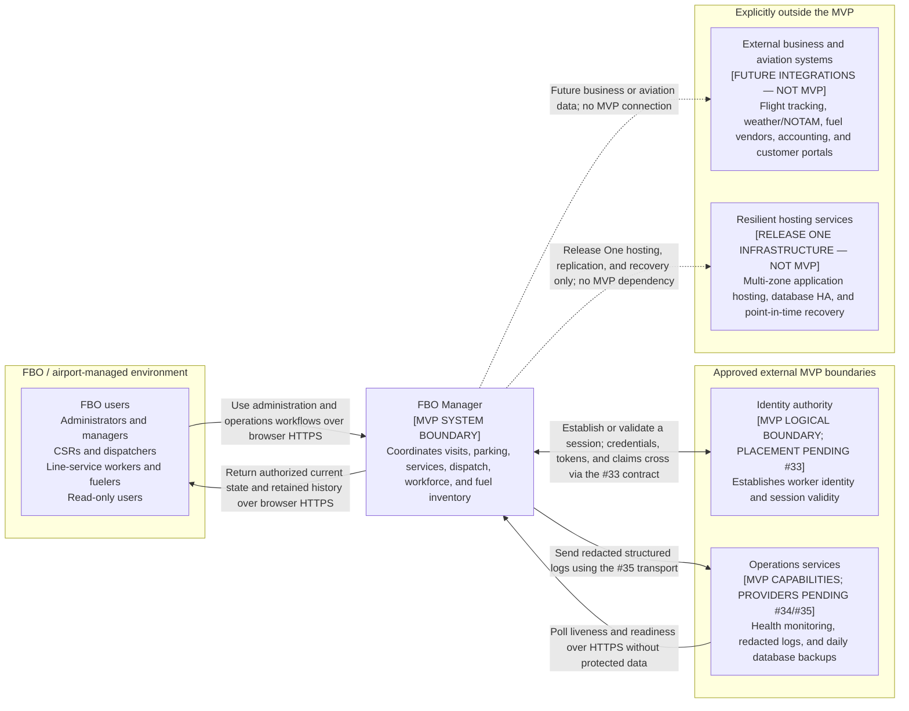
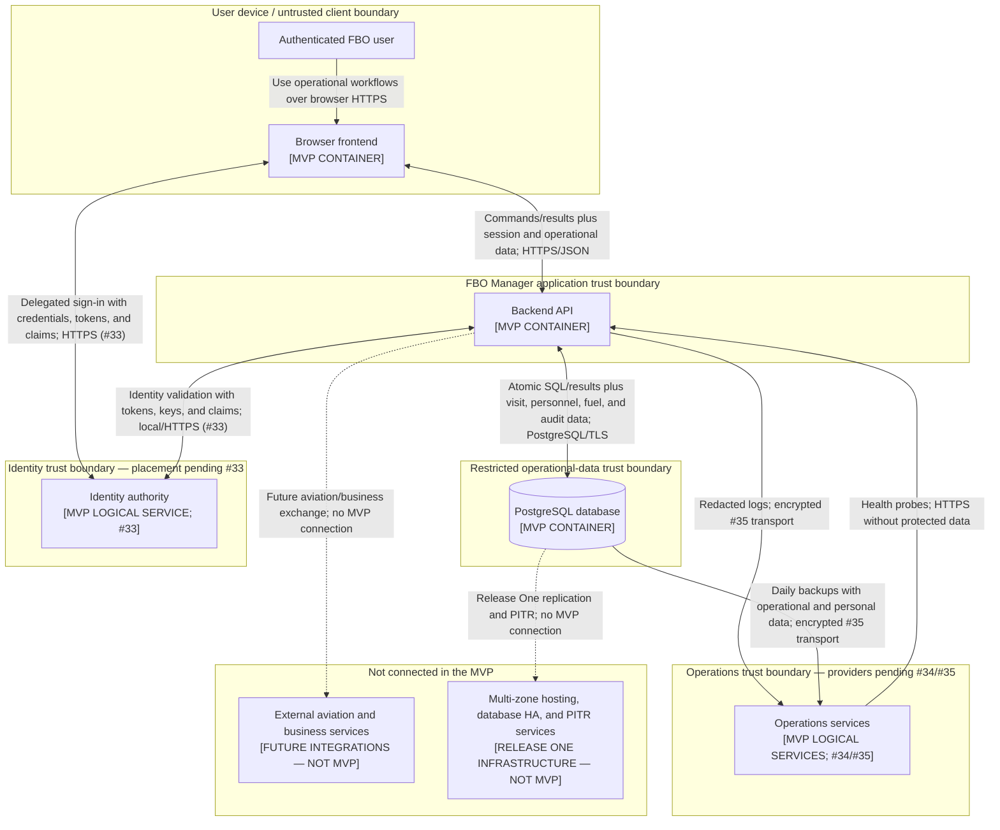

# FBO Manager MVP Architecture

## 1. Purpose and status

This document is the entry point for the FBO Manager MVP architecture. It records the constraints and priorities that guide the more detailed frontend, backend, API, security, deployment, and testing decisions.

The current baseline covers the architecture drivers from GitHub issue [#28](https://github.com/ecillie/FBO_Manager/issues/28) and the system context and container boundaries from issue [#29](https://github.com/ecillie/FBO_Manager/issues/29). Technology selections and detailed design decisions will be added by the remaining architecture issues under the [MVP architecture epic](https://github.com/ecillie/FBO_Manager/issues/5).

The architecture is intentionally optimized for a single FBO operating at one airport. It is not a premature multi-tenant platform design.

## 2. Architecture drivers

The following principles have priority when design choices conflict:

1. **Operational correctness over write availability.** The system must reject a conflicting assignment or inventory movement instead of accepting inconsistent state.
2. **PostgreSQL is the source of truth.** Current operational state is derived from authoritative records, constraints, and transactions rather than duplicated flags.
3. **Critical writes are transactional.** Parking assignments, visit transitions, worker and vehicle dispatch, and fuel movements must complete atomically.
4. **History is retained.** Completed visits, services, tasks, shifts, and fuel transactions are not destroyed by normal application workflows.
5. **Fuel inventory is auditable.** Inventory uses an append-only ledger; corrections use compensating entries.
6. **Time has one storage convention.** Operational timestamps are stored in UTC and interpreted or displayed in the configured airport timezone.
7. **The MVP must remain simple to operate.** One application deployment and one PostgreSQL database are preferred until measured demand justifies additional distributed components.
8. **Security is part of the architecture.** Authentication, least-privilege authorization, encrypted transport, secret management, and audit context are required rather than deferred polish.

## 3. MVP scope

The MVP manages:

- one airport configuration and timezone;
- customers, aircraft manufacturers, models, physical aircraft, owners, and operators;
- expected, inbound, on-ramp, departed, and cancelled aircraft visits;
- nested parking areas, parking spots, availability, occupancy, and aircraft-category preferences;
- aircraft service requests, including fuel-specific quantities and units;
- service vehicles and fuel trucks;
- fuel tanks and append-only tank/truck inventory transactions;
- workers, roles, schedules, attendance, and derived at-work status;
- airport and aircraft-related tasks with worker and vehicle assignments; and
- current-state operational views used by the ramp board.

Detailed actors, workflow boundaries, and failure expectations are maintained in [MVP scope, actors, and workflows](architecture/mvp-scope-and-workflows.md).

## 4. System context and container boundaries

The diagrams use solid arrows for required MVP communication and dashed arrows for explicitly non-MVP relationships. Each arrow points from the initiator or data sender to the recipient and names its purpose, sensitive content where applicable, and protocol constraint. Identity placement, implementation frameworks, and infrastructure providers remain owned by issues #30 through #35; the diagrams do not preselect them.

### 4.1 System context

FBO staff are the only human users in the MVP. The identity authority and operations services are approved logical boundaries because authentication, external health monitoring, and recoverable daily backups are required capabilities. Issues [#33](https://github.com/ecillie/FBO_Manager/issues/33), [#34](https://github.com/ecillie/FBO_Manager/issues/34), and [#35](https://github.com/ecillie/FBO_Manager/issues/35) will decide whether those capabilities are local or delegated and select their deployment products and protocols.

### 4.2 Container diagram

#### Container and logical-service contracts

| Element | Status | Responsibility | Technology choice or constraint | Communication protocols |
| --- | --- | --- | --- | --- |
| Browser frontend | MVP container | Present staff workflows, collect user intent, and provide usability validation without becoming a source of operational truth. | Browser application; framework and client-state approach are selected by issue #30. | HTTPS/JSON with the backend; HTTPS with a delegated identity authority if selected. |
| Backend API | MVP container | Authenticate and authorize requests, enforce business rules, own transactions, and expose bounded current-state queries. | One server application; framework and internal boundaries are selected by issue #31. | HTTPS/JSON with the frontend; PostgreSQL wire protocol over TLS with the database; the identity and operations protocols selected by issues #33 and #35. |
| PostgreSQL database | MVP container | Retain operational history and enforce relational, uniqueness, transactional, and concurrency invariants. | PostgreSQL with ordered, repository-managed migrations; authoritative operational store. | PostgreSQL wire protocol over TLS with the backend; encrypted backup transport selected by issue #35. |
| Identity authority | Required MVP logical service; placement pending | Establish a trusted worker identity and session validity without accepting client-supplied authority. | Local or delegated implementation selected by issue #33. | In-process backend contract if local; HTTPS authentication and validation flow if delegated. |
| Operations services | Required MVP logical services; providers pending | Monitor health, retain redacted structured logs, and create recoverable automated daily backups. | Hosting topology and providers selected by issues #34 and #35; multi-zone HA and PITR remain Release One. | HTTPS health polling plus encrypted log and backup transports selected by issue #35. |

The browser frontend is an untrusted client: it may improve usability with local validation, but the backend repeats all authorization and business-rule checks. The backend is the only container allowed to write operational data, and PostgreSQL remains the authoritative source of truth. There is no direct browser-to-database or browser-to-operations-service connection.

The identity authority is shown as a logical service because issue #33 may place it inside the backend boundary or select a delegated provider. Similarly, the operations box records required MVP capabilities without selecting the hosting, monitoring, logging, or backup products before issues #34 and #35. Any delegated implementation must preserve the labeled trust-boundary protections.

The database is intentionally represented as one container rather than an entity graph. Its tables, relationships, and database-level constraints are maintained in the [detailed database design](database-design.md), [ER diagram](database-er-diagram.md), and [ordered PostgreSQL schema](../db/init/001_schema.sql).

The MVP does not require a message broker, microservice network, separate analytics store, or distributed cache. A later architecture decision may add a component only when a documented workflow or measured quality target requires it.

## 5. Critical workflows

Architecture and testing must cover these end-to-end paths:

1. **Aircraft turnaround:** schedule a visit, mark the aircraft inbound, assign an available spot, record arrival, perform requested services, and record departure.
2. **Fuel fulfillment:** create a fuel request, dispatch an eligible worker and compatible truck, transfer inventory when necessary, dispense fuel, and retain a complete audit trail.
3. **Workforce dispatch:** schedule and start a shift, assign a worker and optional vehicle to a task, start and complete the task, and derive current availability.
4. **Airport administration:** configure the singleton airport, parking layout, reference catalogs, fleet, fuel tanks, and workers without damaging operational history.

Detailed steps, invariants, and expected failure behavior are in [MVP scope, actors, and workflows](architecture/mvp-scope-and-workflows.md).

## 6. Data and consistency baseline

The [database design](database-design.md), [ER diagram](database-er-diagram.md), and initial [PostgreSQL schema](../db/init/001_schema.sql) define the current data model. Architecture decisions must preserve these core invariants:

- no more than one active visit per aircraft;
- no more than one on-ramp aircraft per parking spot;
- no cyclic parking-area hierarchy;
- fuel-service requests contain a compatible fuel type, positive quantity, and unit;
- a worker and vehicle each have no more than one in-progress task;
- a worker has no more than one in-progress shift;
- fuel balances never fall below zero or exceed holder capacity;
- each fuel transaction affects exactly one tank or truck;
- paired transfers commit both ledger entries or neither; and
- current worker and vehicle status is derived rather than independently edited.

## 7. Planning scale

The following values are design and test baselines, not commercial limits:

| Dimension | Expected MVP load | Verification headroom |
| --- | ---: | ---: |
| Concurrent authenticated staff | 25 | 50 |
| Aircraft visits per operating day | 100 | 500 |
| Service requests per operating day | 500 | 2,500 |
| Tasks per operating day | 1,000 | 5,000 |
| Configured parking spots | 100 | 500 |
| Active workers | 100 | 500 |
| Active service vehicles | 100 | 500 |

The values must be revisited with pilot-airport data. The design should prefer correct indexed PostgreSQL queries and bounded API results rather than introducing distributed infrastructure for hypothetical scale.

## 8. Quality-attribute baseline

The detailed scenarios and verification methods are defined in [MVP quality attributes](architecture/quality-attributes.md). The headline targets are:

- normal API reads have a 95th-percentile response time below 500 ms;
- normal operational writes have a 95th-percentile response time below 1 second;
- concurrency-sensitive conflicts fail clearly without partial state;
- the shared MVP environment targets 99.5% monthly availability, excluding planned maintenance;
- automated daily backups support a 24-hour recovery-point objective and four-hour recovery-time objective;
- all access is authenticated except explicit health endpoints;
- authorization is capability-based and tied to active workers;
- sensitive operational changes record actor, time, target, and outcome; and
- logs and API errors never expose secrets, credentials, raw SQL, or stack traces to clients.

## 9. Constraints and non-goals

The following are outside the MVP architecture:

- multi-airport tenancy or cross-airport data sharing;
- billing, invoicing, payments, or accounting integrations;
- external flight tracking, weather, airport, or fuel-vendor integrations;
- offline-first operation or a native mobile application;
- analytics and data-warehouse workloads;
- microservices introduced only for organizational scale;
- production multi-zone high availability and point-in-time recovery, which remain Release One goals; and
- automatic operational decisions that remove the dispatcher’s ability to make an authorized override.

## 10. Decision ownership and follow-up

| Decision area | Tracking issue | Expected artifact |
| --- | --- | --- |
| Context and containers | #29 | System-context and container diagrams |
| Frontend structure | #30 | Frontend architecture decision record |
| Backend boundaries | #31 | Backend architecture decision record |
| API and data flows | #32 | API conventions and sequence diagrams |
| Security | #33 | Identity decision, capability matrix, and threat model |
| Deployment | #34 | Environment and deployment topology |
| Operations | #35 | Observability and recovery model |
| Testing and release | #36 | Test and delivery strategy |
| Consolidation | #37 | Reviewed architecture document and ADR index |

Architecture documentation changes with implementation changes. A pull request that changes a major boundary, trust relationship, persistence rule, or deployment assumption must update the relevant architecture document or decision record.
