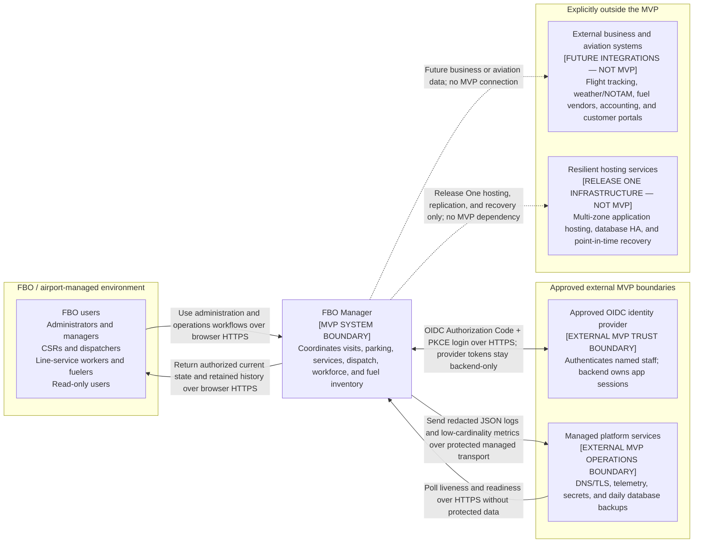
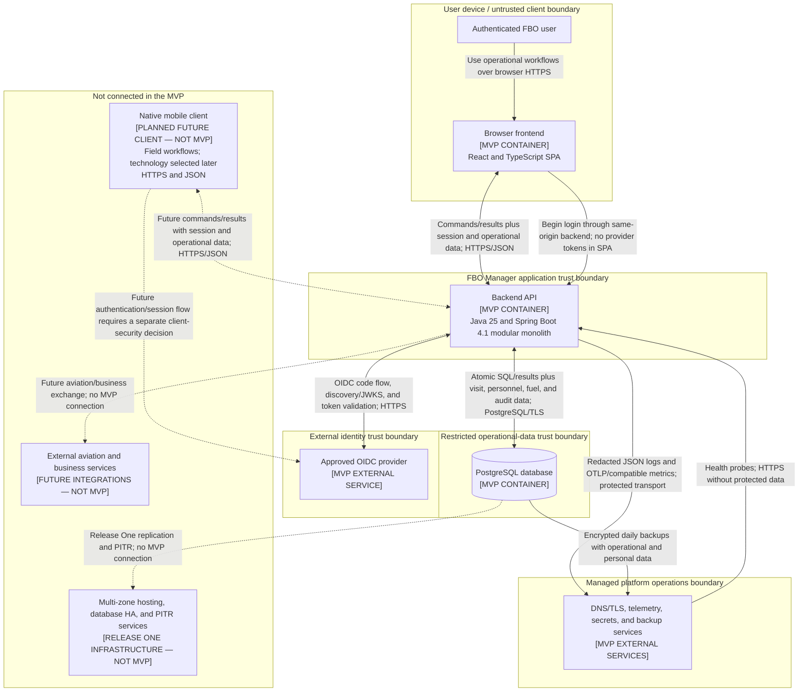
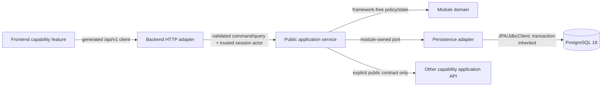

# FBO Manager MVP Architecture

## 1. Purpose and status

This document is the consolidated entry point for the FBO Manager MVP architecture. It assembles the drivers, context, containers, component boundaries, data flows, security, deployment, operations, testing, risks, and decision ownership defined by the [MVP architecture epic #5](https://github.com/ecillie/FBO_Manager/issues/5). Feature implementation remains in the [Backend MVP epic #6](https://github.com/ecillie/FBO_Manager/issues/6).

The accepted decisions are indexed in the [ADR directory](architecture/decisions/README.md). Detailed requirements live beside this document in the [scope/workflows](architecture/mvp-scope-and-workflows.md), [quality attributes](architecture/quality-attributes.md), [API/data flows](architecture/api-contracts-and-data-flows.md), [security](architecture/security.md), [deployment](architecture/deployment.md), [operations/recovery](architecture/operations-and-recovery.md), and [testing/release](architecture/testing-and-release.md) guides. The [implementation traceability matrix](architecture/implementation-traceability.md) maps every backend issue to its controlling sources.

The architecture is intentionally optimized for a single FBO operating at one airport. It is not a premature multi-tenant platform design.

## 2. Architecture drivers

The following principles have priority when design choices conflict:

1. **Operational correctness over write availability.** The system must reject a conflicting assignment or inventory movement instead of accepting inconsistent state.
2. **PostgreSQL is the source of truth.** Current operational state is derived from authoritative records, constraints, and transactions rather than duplicated flags.
3. **Critical writes are transactional.** Parking assignments, visit transitions, worker and vehicle dispatch, and fuel movements must complete atomically.
4. **History is retained.** Completed visits, services, tasks, shifts, and fuel transactions are not destroyed by normal application workflows.
5. **Fuel inventory is auditable.** Inventory uses an append-only ledger; corrections use compensating entries.
6. **Time has one storage convention.** Operational timestamps are stored in UTC and interpreted or displayed in the configured airport timezone.
7. **The MVP must remain simple to operate.** One application deployment and one PostgreSQL database are preferred until measured demand justifies additional distributed components.
8. **Security is part of the architecture.** Authentication, least-privilege authorization, encrypted transport, secret management, and audit context are required rather than deferred polish.

## 3. MVP scope

The MVP manages:

- one airport configuration and timezone;
- customers, aircraft manufacturers, models, physical aircraft, operational classifications, owners, and operators;
- expected, inbound, on-ramp, departed, and cancelled aircraft visits;
- nested parking areas, parking spots, availability, occupancy, and aircraft-category preferences;
- aircraft service requests, including fuel-specific quantities and units;
- service vehicles and fuel trucks;
- fuel tanks and append-only tank/truck inventory transactions;
- workers, roles, schedules, attendance, and derived at-work status;
- airport and aircraft-related tasks with worker and vehicle assignments; and
- current-state operational views used by the ramp board.

Detailed actors, workflow boundaries, and failure expectations are maintained in [MVP scope, actors, and workflows](architecture/mvp-scope-and-workflows.md).

## 4. System context and container boundaries

The diagrams use solid arrows for required MVP communication and dashed arrows for explicitly non-MVP relationships. Each arrow points from the initiator or data sender to the recipient and names its purpose, sensitive content where applicable, and protocol constraint. Their source is the GitHub-rendered Mermaid fenced code stored in this document. Component, API, identity, deployment, and operating choices are recorded in the [ADR index](architecture/decisions/README.md).

### 4.1 System context

FBO staff are the only human users in the MVP. Primary authentication is delegated to an approved OIDC provider; FBO Manager links an exact issuer/subject to an active worker, creates a revocable opaque application session, and remains authoritative for capabilities. Managed platform services supply edge, telemetry, secret, and recoverable-backup capabilities through provider-neutral contracts. Exact providers are deployment configuration, not application dependencies.

A planned native mobile application is an additional FBO Manager client rather than a new human actor or external integration. It is outside the MVP and appears in the container view so its future boundary does not distort the MVP system context.

### 4.2 Container diagram

#### Container and logical-service contracts

| Element | Status | Responsibility | Technology choice or constraint | Communication protocols |
| --- | --- | --- | --- | --- |
| Browser frontend | MVP container | Present staff workflows, collect user intent, and provide usability validation without becoming a source of operational truth. | React 19.2 and TypeScript 6 SPA built with Vite 8.1; React Router 8, TanStack Query 5, React Hook Form/Zod, and Material UI 9. See [ADR 0001](architecture/decisions/0001-frontend-application-architecture.md). | Same-origin HTTPS/JSON with the backend; only an HttpOnly opaque application-session cookie, never OIDC tokens. |
| Native mobile client | Planned future client; not MVP | Present field-oriented workflows without duplicating authorization, transactions, or other business rules from the backend. | Framework, supported devices, distribution, and any offline/session model require a separate future decision. | HTTPS/JSON with the same backend API; authentication/session adaptation requires a future security review. |
| Backend API | MVP container | Authenticate and authorize requests, enforce business rules, own transactions, and expose bounded current-state queries. | Java 25 and Spring Boot 4.1 synchronous modular monolith; Spring Modulith capability boundaries, Spring MVC, Spring Data JPA/Hibernate, `JdbcClient`, Flyway, PostgreSQL JDBC, HikariCP, and Actuator. See [ADR 0002](architecture/decisions/0002-backend-application-architecture.md). | Same-origin HTTPS/JSON with the browser, OIDC over HTTPS, private PostgreSQL 18/TLS, and protected telemetry export. |
| PostgreSQL database | MVP container | Retain operational history and enforce relational, uniqueness, transactional, concurrency, session, idempotency, and application-audit invariants. | Managed PostgreSQL 18 with ordered repository-owned Flyway migrations; authoritative operational store. | Private PostgreSQL wire protocol with verified TLS; encrypted managed backup transport. |
| Identity authority | Required external MVP service | Authenticate named staff; FBO Manager maps exact issuer/subject to an active worker and owns session/authorization. | Approved OIDC provider under [ADR 0004](architecture/decisions/0004-delegated-identity-and-capability-authorization.md). | OIDC Authorization Code with PKCE, discovery/JWKS, and code exchange over HTTPS. |
| Managed platform services | Required external MVP services | Route DNS/TLS, inject secrets, monitor health, retain redacted telemetry, and create recoverable database backups. | Provider-neutral managed container, telemetry, secret, PostgreSQL, and backup capabilities under ADRs [0005](architecture/decisions/0005-portable-single-region-container-deployment.md) and [0006](architecture/decisions/0006-managed-telemetry-and-tested-backup-recovery.md). | HTTPS/private platform paths, OTLP or compatible encrypted telemetry transport, and encrypted backup transport. |

The browser frontend is an untrusted client: it may improve usability with local validation, but the backend repeats all authorization and business-rule checks. The future native mobile application is also an untrusted client and must reuse the same backend API and server-side enforcement. The backend is the only container allowed to write operational data, and PostgreSQL remains the authoritative source of truth. Neither client connects directly to the database or operations services.

The OIDC provider is a deliberate external trust boundary, but it is needed only for new authentication: ordinary authorized API requests validate local server-side session state and current worker capabilities. Managed operations services are shown as one logical boundary because provider products may differ while their access, encryption, redaction, backup, and recovery contracts remain fixed.

The database is intentionally represented as one container rather than an entity graph. Its tables, relationships, and database-level constraints are maintained in the [detailed database design](database-design.md), [ER diagram](database-er-diagram.md), and [ordered Flyway migrations](../backend/src/main/resources/db/migration).

### 4.3 Application component boundaries

The frontend is organized by capability (`auth`, `airport-admin`, `aircraft`, `parking`, `visits`, `services`, `fleet`, `fuel`, `workforce`, `tasks`, and `operations`) over shared shell, design-system, API-client, and test-support layers. Feature UI imports only public feature/shared contracts. TanStack Query owns remote server state; React Hook Form owns transient form state; URL state owns shareable navigation/filter state; local components own ephemeral presentation state. The browser never owns authoritative roles, availability, balances, or workflow state. [ADR 0001](architecture/decisions/0001-frontend-application-architecture.md) is normative.

The backend is a modular monolith with matching capability modules plus identity/access and shared platform configuration. Within a module, HTTP adapters call public application services; application services own authorization inputs, use-case orchestration, transactions, and domain errors; domain code owns framework-free rules; persistence adapters implement module-owned ports. Controllers never call repositories, domain code never imports Spring/JPA, and one module cannot access another module's internal packages or tables through an ad hoc repository. Cross-module access uses an explicit public application contract. [ADR 0002](architecture/decisions/0002-backend-application-architecture.md) and automated Spring Modulith/ArchUnit verification are normative.

The API contract is an adapter boundary, not a serialization of domain or persistence records. Generated frontend types come from the reviewed OpenAPI artifact. Security, telemetry, and database support are cross-cutting adapters that may supply trusted context and infrastructure but cannot bypass a capability's application service.

The MVP does not require a message broker, microservice network, separate analytics store, or distributed cache. A later architecture decision may add a component only when a documented workflow or measured quality target requires it.

## 5. Critical workflows

Architecture and testing must cover these end-to-end paths:

1. **Aircraft turnaround:** schedule a visit, mark the aircraft inbound, assign an available spot, record arrival, perform requested services, and record departure.
2. **Fuel fulfillment:** create a fuel request, dispatch an eligible worker and compatible truck, transfer inventory when necessary, dispense fuel, and retain a complete audit trail.
3. **Workforce dispatch:** schedule and start a shift, assign a worker and optional vehicle to a task, start and complete the task, and derive current availability.
4. **Airport administration:** configure the singleton airport, parking layout, reference catalogs, fleet, fuel tanks, and workers without damaging operational history.

Detailed steps, invariants, and expected failure behavior are in [MVP scope, actors, and workflows](architecture/mvp-scope-and-workflows.md). The frontend/backend exchanges, transaction boundaries, concurrency outcomes, and dashboard read composition are in [API contracts and operational data flows](architecture/api-contracts-and-data-flows.md).

## 6. Data and consistency baseline

The [database design](database-design.md), [ER diagram](database-er-diagram.md), and [Flyway baseline schema](../backend/src/main/resources/db/migration/V1__baseline_schema.sql) define the current data model. Architecture decisions must preserve these core invariants:

- no more than one active visit per aircraft;
- no more than one on-ramp aircraft per parking spot;
- no cyclic parking-area hierarchy;
- fuel-service requests contain a compatible fuel type, positive quantity, and unit;
- a worker and vehicle each have no more than one in-progress task;
- a worker has no more than one in-progress shift;
- fuel balances are estimates that may fall below zero or exceed nominal holder capacity and remain visible for reconciliation;
- each fuel transaction affects exactly one tank or truck;
- paired transfers commit both ledger entries or neither; and
- current worker and vehicle status is derived rather than independently edited.

## 7. Security and trust model

[ADR 0004](architecture/decisions/0004-delegated-identity-and-capability-authorization.md) selects delegated OIDC authentication with Authorization Code and PKCE. The backend maps exact `(issuer, sub)` values to an explicitly linked active `workers` row, discards provider tokens after validation, and creates a revocable opaque application session. The browser stores only a host-only `Secure`, `HttpOnly`, `SameSite=Lax` cookie; unsafe methods additionally require same-origin and session-bound CSRF validation. There is no self-sign-up, email-based identity matching, or locally stored staff password.

Authorization is server-side and capability-based. The initial roles are `ADMINISTRATOR`, `DISPATCHER`, `FUEL_MANAGER`, `WORKFORCE_MANAGER`, `OPERATOR`, and `VIEWER`; current capabilities and active-worker state are checked on every request. Role/identity changes, denied sensitive actions, dispatch overrides, fuel movements/adjustments, session events, and administrative changes create append-only audit events distinct from diagnostic logs. A one-time non-HTTP command bootstraps the first named MFA-protected administrator only while no administrator exists, then is disabled.

All public traffic uses TLS, production is same-origin, CORS allowlists exact origins, rate limits cover login and authenticated APIs, protected data is not publicly cached, and strict browser headers limit script/frame/content capabilities. Credentials, database passwords, session/hash keys, and telemetry/backup credentials come from a managed secret boundary and never enter the repository, frontend, image layers, or logs. The detailed capability matrix, lifecycle, audit fields, bootstrap procedure, and threat analysis are in [Security architecture and threat model](architecture/security.md).

## 8. Environments and deployment

[ADR 0005](architecture/decisions/0005-portable-single-region-container-deployment.md) selects a portable single-region managed-container topology. Local development and CI use disposable containers and PostgreSQL 18. Development, NonProd, and production/pilot use separate accounts/projects, OIDC clients, configuration, secret sets, databases, telemetry, backups, and access groups; production data never enters local, CI, or Development.

CI builds immutable `fbo-web` and `fbo-api` OCI images. The web image serves hashed SPA assets and same-origin proxy paths; the API image runs Java 25/Spring Boot 4.1. A short-lived `fbo-migrate` command from the exact API digest applies Flyway migrations with a separate database identity before API replacement. Shared environments use managed PostgreSQL 18 on private port `5432` with certificate-verified TLS. Only public HTTPS `443` is exposed; backend `8080`, management `8081`, database, metrics, and detailed health paths stay private.

Configuration is validated at startup and separated into immutable build metadata, reviewed non-secret environment settings, runtime-injected secrets, and audited business configuration. Startup never runs migrations. Liveness excludes dependencies; readiness includes schema compatibility and a bounded database check. Shutdown marks the instance unready and drains for up to 30 seconds. Schema evolution is expand/migrate/contract; production has no automatic down migrations. A schema-compatible application may roll back, otherwise a new forward migration fixes the release. The MVP accepts one web/API instance and one database primary with low rather than zero downtime; multi-zone HA and PITR remain Release One work. Full topology, ports, pools, resources, and ownership are in [Environments, configuration, and deployment topology](architecture/deployment.md).

## 9. Observability, reliability, and recovery

[ADR 0006](architecture/decisions/0006-managed-telemetry-and-tested-backup-recovery.md) separates best-effort diagnostic telemetry, required audit events, and authoritative domain history. The API writes allowlisted JSON logs to standard output and exports low-cardinality service/JVM/database/workflow metrics through OTLP or a compatible managed collector. Request ID, release, route template, outcome, duration, and server-derived actor context support correlation without logging bodies, tokens, cookies, personal contact data, raw SQL values, or high-cardinality entity labels.

Actionable alerts cover public/readiness failure, server errors, latency, database/pool health, storage, backup age, restore-test age, authentication anomalies, audit persistence, conflict spikes, fuel anomalies, and crash/resource saturation. Each alert has a platform, application, database, security, release, fuel, or FBO operations owner and response expectation. Slow-query monitoring uses sanitized PostgreSQL fingerprints and representative performance data.

Parking, task dispatch, and paired fuel transfers fail atomically; unknown outcomes reuse their idempotency key. Telemetry collector failure may drop bounded diagnostic detail but does not roll back business data; required audit persistence does fail its sensitive command closed. Production receives encrypted automated backups at least daily, retains 35 daily recovery points and 12 monthly points where supported, and completes an isolated PostgreSQL 18 restore exercise at least quarterly. The accepted MVP RPO is 24 hours and RTO is four hours. Manual continuity/reconciliation is required during an outage; automatic failover and PITR are deferred. [Observability, reliability, audit, and recovery](architecture/operations-and-recovery.md) defines fields, metrics, alerts, retention, failure behavior, and the restore sequence.

## 10. Testing, CI/CD, and release

[ADR 0007](architecture/decisions/0007-layered-verification-and-immutable-promotion.md) defines a risk-based verification pyramid: pure domain/application unit tests; Spring Modulith/ArchUnit boundaries; PostgreSQL 18 migration/repository tests; full API/security/OpenAPI tests; synchronized real-database concurrency tests; frontend component/accessibility tests; critical Playwright browser flows; and scheduled or pre-release performance, fault, and restore exercises. Deterministic builders, fixed clocks/seeds, disposable databases, real Flyway migrations, and no hidden rerun of failed assertions make results reproducible. [ADR 0008](architecture/decisions/0008-environment-aligned-branch-promotion.md) defines the current `FBODev` → `Release-<version>` → `FBOProd` promotion path and the solo-review transition.

Ordinary ticket branches use `<issue-number>-<short-description>`, start from `FBODev`, and return through protected squash-merge pull requests. Required checks cover formatting/lint/type/static/architecture rules, applicable test layers, migration/seed/OpenAPI/generated-client consistency, frozen dependency resolution, secret/vulnerability/license/image scanning, SBOMs, and least-privilege workflow review. With one developer, a recorded self-review and complete automation replace an impossible second-developer merge rule; independent/path-owner approval becomes mandatory when a second qualified contributor joins, while sensitive production promotion still requires explicit risk and stakeholder approval.

`FBODev` deploys development integrations. The versioned `Release-1.0.0` candidate builds web/API images, OpenAPI/client artifacts, SBOMs, provenance, checksums, and the release manifest once for NonProd acceptance. After approval, its source tree merges to `FBOProd`, receives tag `v1.0.0`, and production deploys the same signed candidate digests without rebuilding. Release preflight verifies backup and migration compatibility, runs the one migration job, deploys with graceful readiness, exercises health/auth/dashboard/critical safe checks, and observes errors, latency, pools, audit, and workflows for at least 30 minutes for an ordinary change. [Testing, CI/CD, and release strategy](architecture/testing-and-release.md) contains the rule/state-machine test map, coverage gates, branch policy, supply-chain controls, promotion flow, and documentation-change triggers.

## 11. Planning scale

The following values are design and test baselines, not commercial limits:

| Dimension | Expected MVP load | Verification headroom |
| --- | ---: | ---: |
| Concurrent authenticated staff | 25 | 50 |
| Aircraft visits per operating day | 100 | 500 |
| Service requests per operating day | 500 | 2,500 |
| Tasks per operating day | 1,000 | 5,000 |
| Configured parking spots | 100 | 500 |
| Active workers | 100 | 500 |
| Active service vehicles | 100 | 500 |

The values must be revisited with pilot-airport data. The design should prefer correct indexed PostgreSQL queries and bounded API results rather than introducing distributed infrastructure for hypothetical scale.

## 12. Quality-attribute baseline

The detailed scenarios and verification methods are defined in [MVP quality attributes](architecture/quality-attributes.md). The headline targets are:

- normal API reads have a 95th-percentile response time below 500 ms;
- normal operational writes have a 95th-percentile response time below 1 second;
- concurrency-sensitive conflicts fail clearly without partial state;
- the shared MVP environment targets 99.5% monthly availability, excluding planned maintenance;
- automated daily backups support a 24-hour recovery-point objective and four-hour recovery-time objective;
- all access is authenticated except explicit health endpoints;
- authorization is capability-based and tied to active workers;
- sensitive operational changes record actor, time, target, and outcome; and
- logs and API errors never expose secrets, credentials, raw SQL, or stack traces to clients.

## 13. Assumptions, risks, deferred work, and open approvals

### Assumptions

- The MVP serves one FBO at one airport, with the planning scale in section 11 and reliable staff network/browser access.
- The FBO approves an OIDC provider capable of named individual accounts and MFA, designates operational/security/database owners, and accepts the published session and recovery limits.
- The selected managed platform supplies private networking, secret injection, encrypted managed PostgreSQL 18, telemetry, daily backups, and named access controls that meet the provider-neutral contracts.
- Production uses one public origin and synthetic/sanitized data outside production.

### Principal risks and responses

| Risk | MVP response |
| --- | --- |
| One application instance or database primary fails | Safe readiness/failure, named alerts/runbooks, daily backups, quarterly restore, four-hour RTO; Release One adds multi-zone/HA/PITR. |
| OIDC provider is unavailable or an account is compromised | Existing bounded local sessions do not call the provider; new login fails safely; MFA, exact subject links, local worker/session revocation, and 12-hour absolute session lifetime limit exposure. |
| Concurrent operational writes or an unknown client outcome | PostgreSQL constraints/locks/atomic transactions plus persisted idempotency; one result commits and a retry replays it. |
| Personal or operational data leaks through clients, logs, lower environments, or backups | Least privilege, TLS, exact-origin controls, safe errors, redaction allowlists, synthetic lower data, encrypted isolated backups, and audited access/export. |
| Vendor-neutral deployment leaves provider details incomplete | Issue #27 records exact provider commands, dashboards, contacts, secret paths, backup/restore, and troubleshooting before pilot use. |
| Initial capacity or alert thresholds are wrong | Run the representative headroom profile, observe pilot baselines, tune documented settings without weakening correctness/security targets. |

### Deferred Release One work

Release One owns multi-zone application/database availability, point-in-time recovery, tighter approved RPO/RTO, tested failover, progressive delivery when justified, capacity forecasting/autoscaling, final regulatory/business retention, and any native/offline client security model. Multi-airport tenancy, external aviation/business integrations, analytics, and microservices remain outside both MVP implementation and this baseline unless separately approved.

### Required stakeholder approvals

No architectural design question blocks MVP implementation. Before live pilot launch, stakeholders must select the conforming OIDC and managed-platform providers, name primary/backup operational roles, approve the 24-hour RPO/four-hour RTO and manual continuity process, approve the 365-day minimum audit retention or a longer policy, provide production DNS/origins, and complete the first administrator plus restore exercise. These are deployment approvals within accepted boundaries, not unresolved component decisions.

## 14. Constraints and non-goals

The following are outside the MVP architecture:

- multi-airport tenancy or cross-airport data sharing;
- billing, invoicing, payments, or accounting integrations;
- external flight tracking, weather, airport, or fuel-vendor integrations;
- a native mobile application or offline operation during the MVP; a future native client will reuse the backend API;
- analytics and data-warehouse workloads;
- microservices introduced only for organizational scale;
- production multi-zone high availability and point-in-time recovery, which remain Release One goals; and
- automatic operational decisions that remove the dispatcher’s ability to make an authorized override.

## 15. Decision ownership and implementation traceability

| Decision area | Tracking issue | Expected artifact |
| --- | --- | --- |
| Drivers, scope, workflows, and quality attributes | [#28](https://github.com/ecillie/FBO_Manager/issues/28) | This document, [workflow definitions](architecture/mvp-scope-and-workflows.md), and [quality attributes](architecture/quality-attributes.md) |
| Context and containers | [#29](https://github.com/ecillie/FBO_Manager/issues/29) | System-context and container diagrams in this document |
| Frontend structure | [#30](https://github.com/ecillie/FBO_Manager/issues/30) | [ADR 0001: Frontend application architecture and state boundaries](architecture/decisions/0001-frontend-application-architecture.md) |
| Backend boundaries | [#31](https://github.com/ecillie/FBO_Manager/issues/31) | [ADR 0002: Backend application architecture and dependency boundaries](architecture/decisions/0002-backend-application-architecture.md) |
| API and data flows | [#32](https://github.com/ecillie/FBO_Manager/issues/32) | [API contracts and operational data flows](architecture/api-contracts-and-data-flows.md) and [ADR 0003](architecture/decisions/0003-api-contracts-and-operational-data-flows.md) |
| Security | [#33](https://github.com/ecillie/FBO_Manager/issues/33) | [Security architecture and threat model](architecture/security.md) and [ADR 0004](architecture/decisions/0004-delegated-identity-and-capability-authorization.md) |
| Deployment | [#34](https://github.com/ecillie/FBO_Manager/issues/34) | [Environments, configuration, and deployment topology](architecture/deployment.md) and [ADR 0005](architecture/decisions/0005-portable-single-region-container-deployment.md) |
| Operations | [#35](https://github.com/ecillie/FBO_Manager/issues/35) | [Observability, reliability, audit, and recovery](architecture/operations-and-recovery.md) and [ADR 0006](architecture/decisions/0006-managed-telemetry-and-tested-backup-recovery.md) |
| Testing and release | [#36](https://github.com/ecillie/FBO_Manager/issues/36) | [Testing, CI/CD, and release strategy](architecture/testing-and-release.md), [ADR 0007](architecture/decisions/0007-layered-verification-and-immutable-promotion.md), and [ADR 0008](architecture/decisions/0008-environment-aligned-branch-promotion.md) |
| Consolidation | [#37](https://github.com/ecillie/FBO_Manager/issues/37) | This consolidated entry point, [ADR index](architecture/decisions/README.md), and [implementation traceability matrix](architecture/implementation-traceability.md) |

The [implementation traceability matrix](architecture/implementation-traceability.md) maps Backend MVP issues #7–#27 to these decisions and constraints. Architecture documentation changes with implementation: the exact triggers are defined by the [testing and release strategy](architecture/testing-and-release.md#10-architecture-and-documentation-change-rules). A major boundary, trust relationship, source-of-truth rule, API compatibility rule, deployment/recovery assumption, or release-safety strategy requires the relevant guide and ADR to be updated or superseded in the same pull request.

After stakeholder review approves this baseline and the launch-time approvals in section 13 have named owners, consolidation issue #37 and parent epic #5 may close. Closing them does not waive the living-document rule or move deferred Release One work into the MVP.
