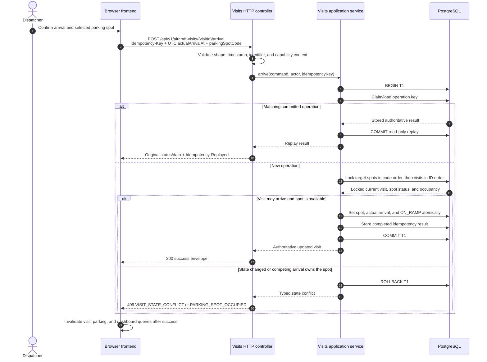

# API Contracts and Operational Data Flows

## 1. Purpose and scope

This document defines the stable HTTP and JSON boundary between FBO Manager clients and the backend and shows how the most important operational commands cross frontend, application-module, and PostgreSQL boundaries. It implements the architecture decision recorded in [ADR 0003](decisions/0003-api-contracts-and-operational-data-flows.md) for GitHub issue [#32](https://github.com/ecillie/FBO_Manager/issues/32).

The conventions are requirements for [issue #12](https://github.com/ecillie/FBO_Manager/issues/12), which implements the shared backend HTTP layer, and [issue #24](https://github.com/ecillie/FBO_Manager/issues/24), which publishes and validates the machine-readable OpenAPI contract. This document defines behavior and examples; the canonical route and schema inventory will be `contracts/openapi/v1.yaml` when issue #24 is implemented.

Identity and capability details remain owned by issue #33. Every route described here is authenticated unless the security decision explicitly marks it as a health endpoint.

## 2. HTTP API style and versioning

The MVP uses a synchronous, resource-oriented REST API over HTTPS with UTF-8 JSON. Ordinary create, read, and update operations use HTTP methods and resource URLs. State transitions that represent an operational command, such as arriving a visit or dispatching a task, use an explicit subordinate command resource rather than pretending the transition is an unrestricted record update.

| Concern | Convention |
| --- | --- |
| Base path | `/api/v1` |
| Transport | HTTPS; HTTP is permitted only for an isolated local developer environment |
| Media type | `application/json`; requests with a JSON body send `Content-Type: application/json` |
| Paths | Lowercase plural nouns in kebab-case; no trailing slash |
| JSON properties | lower camel case, for example `estimatedArrivalAt` |
| Query parameters | lower camel case, with repeated parameters only where documented |
| Enum values | Upper snake case, for example `ON_RAMP` and `JET_A` |
| Generated identifiers | Base-10 strings in JSON so JavaScript clients never lose `BIGINT` precision |
| Natural identifiers | Strings in their canonical database form; path values are percent-encoded |
| Command routes | `POST` to a named subordinate resource, for example `/aircraft-visits/{visitId}/arrival` |

The route prefix is a major contract version, not an implementation or deployment version. Backward-compatible additions stay in `v1`. A change requires `/api/v2` when it removes or renames a field or route, changes field meaning or type, tightens previously valid input, changes quantity or timestamp representation, or adds a value to a closed enum that generated clients are not required to tolerate. A new optional response property, optional query parameter, resource route, or documented error code is normally additive.

The OpenAPI diff in issue #24 is the enforcement point for breaking-change review. When a new major version is necessary, the old and new versions coexist for a documented migration window; a deployed `v1` contract is not silently replaced. Deprecation is recorded in OpenAPI and release documentation before removal.

## 3. JSON representation conventions

| Data kind | Wire representation | Rules |
| --- | --- | --- |
| Instant | String such as `2026-08-09T14:03:27.125Z` | RFC 3339/ISO 8601 UTC with a `Z` suffix and at most microsecond precision. Requests must also use UTC. |
| Calendar date | String such as `2026-08-09` | `YYYY-MM-DD`; never converted implicitly to an instant. |
| Airport-local input | Separate local date/time and IANA timezone only on a route that explicitly requires local scheduling | The backend rejects nonexistent local times and requires explicit disambiguation for repeated daylight-saving times. Authoritative instants are returned in UTC. |
| Fixed-precision quantity | Decimal string such as `"125.000"` | Exactly three fractional digits, no exponent or grouping separators, within PostgreSQL `NUMERIC(14,3)`. A controlled `quantityUnit` travels with the value. |
| Generated database ID | Decimal string such as `"9007199254740993"` | OpenAPI uses `type: string` with a digit pattern, even though the backend uses `long`. |
| Boolean | JSON `true` or `false` | Strings and numeric substitutes are invalid. |
| Optional value | Omitted unless the schema explicitly permits `null` | Omission and clearing are distinct on update requests. Unknown request properties are rejected. |

Quantities are parsed to `BigDecimal` in the backend and remain strings in the frontend. Binary floating-point types are not used for inventory, capacity, or requested quantities. The MVP performs no automatic unit conversion. An out-of-range estimated fuel balance remains visible with its actual signed decimal value.

## 4. Bounded collections, filtering, and sorting

Every collection is bounded. The shared page query is:

```http
GET /api/v1/aircraft-visits?page=0&size=50&status=INBOUND&sort=estimatedArrivalAt,asc&sort=visitId,asc
```

- `page` is zero-based and defaults to `0`.
- `size` defaults to `25`, must be between `1` and `100`, and is never silently raised above `100`.
- `sort` is repeatable and has the form `<documentedField>,asc|desc`. Each endpoint allowlists sortable API fields rather than accepting database column names.
- Resource-specific filters use documented camel-case query parameters. Different filter names combine with AND; repeated values for a documented multi-value filter combine with OR.
- Time ranges use inclusive `...From` and exclusive `...Before` UTC instants. Text search, when provided, uses a documented `q` parameter and endpoint-specific fields.
- Unknown filters, unsupported sort fields or directions, invalid ranges, and malformed page values return `400 INVALID_QUERY`.
- Every endpoint documents a default order. The backend appends a stable unique identifier as a final tie-breaker so page ordering is deterministic.

The collection response uses the normal success envelope:

```json
{
  "data": [
    {
      "visitId": "1842",
      "tailNumber": "N123AB",
      "status": "INBOUND",
      "estimatedArrivalAt": "2026-08-09T14:15:00Z"
    }
  ],
  "page": {
    "number": 0,
    "size": 50,
    "totalElements": 1,
    "totalPages": 1,
    "sort": ["estimatedArrivalAt,asc", "visitId,asc"]
  },
  "meta": {
    "requestId": "0198a6ab-4688-7c80-9ddb-0242ac120002",
    "timestamp": "2026-08-09T14:03:27.125Z"
  }
}
```

Offset paging is selected for the MVP's modest, user-navigated operational tables. A future high-volume append-only feed may add a separately documented cursor mode, but it must not change an existing `v1` page contract in place.

## 5. Request validation and response envelopes

### 5.1 Validation boundary

Validation occurs before a command reaches authoritative state-changing logic and is repeated at the layer that owns each rule.

| Layer | Responsibility | Failure |
| --- | --- | --- |
| HTTP parsing | Media type, body-size limit, well-formed JSON, known properties, parameter syntax | `400 INVALID_REQUEST` or `413 REQUEST_TOO_LARGE` |
| Request DTO | Required fields, lengths, formats, exact enum spelling, quantity precision/positivity, timestamp shape, page bounds | `400 REQUEST_VALIDATION_FAILED` with field errors |
| Application service | Resource existence, lifecycle transition, fuel compatibility, cross-record rules, authorization inputs | `404`, `403`, or `422` with a stable domain code |
| Transaction and persistence adapters | Locked current state, uniqueness, foreign key, check constraint, deadlock/timeout classification | `409`, `422`, or `503`; never raw SQL or a driver message |

Client validation is for usability only. The backend never trusts client-supplied actor IDs, permissions, calculated balances, availability flags, or current-state assertions.

### 5.2 Success envelope

JSON successes contain `data` and `meta`. Creates return `201 Created` plus `Location`; reads, updates, and synchronous commands normally return `200 OK`. `204 No Content` is reserved for a route whose OpenAPI operation explicitly has no representation, such as deletion of an unused configuration junction.

```json
{
  "data": {
    "visitId": "1842",
    "status": "ON_RAMP",
    "parkingSpotCode": "RAMP_A_12",
    "actualArrivalAt": "2026-08-09T14:07:11.432Z"
  },
  "meta": {
    "requestId": "0198a6af-194d-7046-a30c-0242ac120002",
    "timestamp": "2026-08-09T14:07:11.441Z"
  }
}
```

The envelope is an API DTO, never a serialized JPA entity or Spring Data `Page`.

### 5.3 Error envelope

Every non-health error uses this shape. Optional `fieldErrors` and `details` are omitted when empty. Details are allowlisted safe values that help a client resolve the problem; they never contain SQL, stack traces, credentials, tokens, or unredacted request bodies.

```json
{
  "error": {
    "status": 409,
    "code": "PARKING_SPOT_OCCUPIED",
    "message": "Parking spot RAMP_A_12 is no longer available.",
    "requestId": "0198a6b2-4e86-7da9-8d76-0242ac120002",
    "timestamp": "2026-08-09T14:09:04.018Z",
    "retryable": false,
    "details": {
      "parkingSpotCode": "RAMP_A_12",
      "currentVisitId": "1841"
    }
  }
}
```

Validation errors additionally use a stable ordered array:

```json
{
  "error": {
    "status": 400,
    "code": "REQUEST_VALIDATION_FAILED",
    "message": "The request contains invalid fields.",
    "requestId": "0198a6b5-0adb-7757-a0a8-0242ac120002",
    "timestamp": "2026-08-09T14:11:58.702Z",
    "retryable": false,
    "fieldErrors": [
      {
        "field": "requestedQuantity",
        "code": "POSITIVE_DECIMAL_REQUIRED",
        "message": "Must be a positive decimal with three fractional digits."
      }
    ]
  }
}
```

Application codes are uppercase snake case and remain stable within an API major version. The shared status mapping is:

| HTTP status | Meaning |
| ---: | --- |
| `400` | Malformed request, DTO validation, or invalid query syntax |
| `401` | Missing, invalid, or expired authentication |
| `403` | Authenticated actor lacks the required capability or override authority |
| `404` | Resource does not exist or is not visible to the actor |
| `409` | Current state, uniqueness, idempotency, or concurrency prevents the command |
| `413` | Request body exceeds the configured limit |
| `422` | Structurally valid request violates a domain compatibility or transition rule |
| `429` | A documented request limit is exceeded; return `Retry-After` when known |
| `500` | Unexpected failure with a generic safe message |
| `503` | An approved required dependency is unavailable |

The backend accepts a syntactically valid `X-Request-Id` or creates one, places the authoritative value in logging context, returns it in the response header, and includes it in the envelope. A client-provided identifier is correlation input, not trusted audit identity.

## 6. Idempotency and explicit retries

The browser does not automatically retry mutations. A user may explicitly retry an unknown outcome only when OpenAPI marks the operation idempotent, reusing the original `Idempotency-Key`. A new user intent always gets a new key.

The header is required for operations that can create a duplicate operational or inventory effect:

| Operation family | Requirement |
| --- | --- |
| Create an aircraft visit, service request, or task | Required |
| Arrive/depart/cancel a visit or assign/reassign parking | Required |
| Dispatch/start/complete a task or transition a service request | Required |
| Record a fuel receipt, tank-to-truck transfer, aircraft dispense, or adjustment | Required and retained with the ledger evidence |
| Ordinary idempotent read | Not used |
| Configuration update with an explicit target state | Optional unless its OpenAPI operation requires it |

Keys are opaque values of 16 through 128 ASCII characters from `A-Z`, `a-z`, `0-9`, `.`, `_`, `:`, and `-`; UUIDv4 or UUIDv7 is the recommended client format. The server namespaces a key by API major version and OpenAPI operation ID, then fingerprints the validated canonical command including trusted actor context.

The application service claims the key and commits its completed outcome in the same PostgreSQL transaction as the business effect. The behavior is:

1. A new key and fingerprint execute once.
2. A committed matching key returns the original status and authoritative data with the current request ID and `Idempotency-Replayed: true`; it creates no new business rows.
3. The same key with a different fingerprint returns `409 IDEMPOTENCY_KEY_REUSED`.
4. A concurrent matching request waits for the first transaction within the configured lock budget, then replays it. If the budget expires, it returns retryable `409 IDEMPOTENCY_IN_PROGRESS` with `Retry-After` and no business effect.
5. A rolled-back command has no completed idempotency outcome, so an explicit retry may execute normally.

Completed records for inventory writes are retained at least as long as their immutable ledger evidence. Other completed command records are retained for at least 24 hours. Issue #11 must add the persistence structure and uniqueness needed by this contract; issue #7 owns the transactional application behavior; issue #12 owns header validation and replay response handling.

## 7. Critical operational sequences

Each write transaction below begins and ends at a public application-service command. Controllers validate and map HTTP, but never open transactions. A response is not successful until PostgreSQL commits.

### 7.1 Aircraft arrival and parking



If two dispatchers choose the same spot, the second transaction waits for the contested lock, observes the committed occupancy, and rolls back without changing its visit. The partial unique index remains the final backstop. A valid retry with the original idempotency key replays instead of repeating the transition.

### 7.2 Service creation and task dispatch

For a requested service that requires field work, service creation also creates its linked `PENDING` task in the same transaction. Dispatching starts that task and transitions the linked service to `IN_PROGRESS` atomically; it does not expose a moment when the task claims resources but the service remains requested.

```mermaid
sequenceDiagram
    autonumber
    actor Dispatcher
    participant UI as Browser frontend
    participant API as Services and tasks controllers
    participant Services as Services application service
    participant Tasks as Tasks application service
    participant DB as PostgreSQL

    Dispatcher->>UI: Add service to active visit
    UI->>API: POST /api/v1/aircraft-visits/{visitId}/service-requests<br/>Idempotency-Key + service fields
    API->>Services: createRequest(command, actor, key)
    Services->>DB: BEGIN T1
    Services->>DB: Claim key; lock visit; validate active visit and service compatibility
    Services->>DB: Insert REQUESTED service
    Services->>Tasks: createPendingTask(linked service command)
    Tasks->>DB: Insert linked PENDING task
    Services->>DB: Store completed key outcome
    alt All inserts succeed
        Services->>DB: COMMIT T1
        API-->>UI: 201 service plus linked task
    else Validation, state, or persistence conflict
        Services->>DB: ROLLBACK T1
        API-->>UI: 422 domain error or 409 conflict; neither record exists
    end

    Dispatcher->>UI: Dispatch worker and compatible vehicle
    UI->>API: POST /api/v1/tasks/{taskId}/dispatch<br/>Idempotency-Key + workerId + optional vehicleIdentifier
    API->>Tasks: dispatchAndStart(command, actor, key)
    Tasks->>DB: BEGIN T2
    Tasks->>DB: Claim key; lock workers by ID, vehicles by identifier, then task
    DB-->>Tasks: Locked shift, availability, task, and linked service state
    alt Resources eligible and unclaimed
        Tasks->>DB: Set assignments, startedAt, and task IN_PROGRESS
        Tasks->>DB: Set linked service IN_PROGRESS and store key outcome
        Tasks->>DB: COMMIT T2
        API-->>UI: 200 task and service summaries
    else Worker, vehicle, task, or service changed concurrently
        Tasks->>DB: ROLLBACK T2
        API-->>UI: 409 RESOURCE_UNAVAILABLE or TASK_STATE_CONFLICT
    end
    UI->>UI: Invalidate service, task, workforce, fleet, and dashboard queries
```

The service/task creation transaction and dispatch transaction are deliberately separate user intents. A dispatch conflict leaves the task `PENDING`, the service `REQUESTED`, and both resources unclaimed. Partial unique indexes for in-progress worker and vehicle assignments remain database backstops.

### 7.3 Tank-to-truck-to-aircraft fuel movement

The aircraft is not an inventory holder in the database. A dispense is the immutable negative truck entry linked to the aircraft's service request, which supplies the visit and aircraft evidence.

```mermaid
sequenceDiagram
    autonumber
    actor Fueler
    participant UI as Browser frontend
    participant API as Fuel HTTP controller
    participant Fuel as Fuel application service
    participant DB as PostgreSQL

    Fueler->>UI: Record tank-to-truck transfer
    UI->>API: POST /api/v1/fuel/transfers<br/>Idempotency-Key + tank + truck + quantity + unit + occurredAt
    API->>Fuel: transfer(command, actor, key)
    Fuel->>DB: BEGIN T1
    Fuel->>DB: Claim key; lock tank and truck in canonical holder order
    Fuel->>DB: Validate fuel type, unit, active holders, and nonzero quantity
    alt Compatible transfer
        Fuel->>DB: Allocate transferGroupId
        Fuel->>DB: Insert negative tank and positive truck ledger entries
        Fuel->>DB: Store completed key outcome
        Fuel->>DB: COMMIT T1
        API-->>UI: 201 paired transfer and updated estimates
    else Mismatch or concurrent state invalidates command
        Fuel->>DB: ROLLBACK T1
        API-->>UI: 422 FUEL_COMPATIBILITY_ERROR or 409 CONCURRENT_MODIFICATION
    end

    Fueler->>UI: Record aircraft dispense for service request
    UI->>API: POST /api/v1/fuel/dispenses<br/>Idempotency-Key + truck + serviceRequestId + quantity + unit + occurredAt
    API->>Fuel: dispense(command, actor, key)
    Fuel->>DB: BEGIN T2
    Fuel->>DB: Claim key; lock truck, service request, and linked task in defined order
    Fuel->>DB: Validate compatible fuel and active service/task state
    alt Valid dispense
        Fuel->>DB: Insert negative truck ledger entry linked to service request and actor
        Fuel->>DB: Store completed key outcome
        Fuel->>DB: COMMIT T2
        API-->>UI: 201 dispense evidence and updated truck estimate
    else Duplicate key, mismatch, or changed service state
        Fuel->>DB: Replay committed result or ROLLBACK T2
        API-->>UI: Replay, 422 compatibility error, or 409 state conflict
    end
    UI->>UI: Invalidate fuel holder, service, task, and dashboard queries
```

Both sides of a transfer commit or neither does. Different-key movements against the same holder serialize on its row lock. An estimate below zero or above nominal capacity is not itself a rejection condition; it remains visible for reconciliation. A lock timeout or deadlock rolls back the whole command and becomes a safe retryable conflict. Reusing the same idempotency key can never add another ledger effect.

### 7.4 Transaction and conflict summary

| Use case | Atomic unit | Locks and authoritative checks | Failed outcome |
| --- | --- | --- | --- |
| Arrive and park | Visit status, spot, arrival time, audit/idempotency outcome | Target spots, then visits | `409`; visit and spot remain unchanged |
| Create field service | Service request, linked pending task, idempotency outcome | Visit and relevant reference state | `422`/`409`; neither service nor task exists |
| Dispatch and start | Worker/vehicle assignment, task start, linked service start, idempotency outcome | Workers, vehicles, then tasks in deterministic order | `409`; task/service/resources remain in prior state |
| Tank-to-truck transfer | Two opposite ledger entries, shared transfer group, idempotency outcome | Both holders in canonical order | `422`/`409`; neither ledger entry exists |
| Aircraft dispense | Truck ledger entry, service link, actor evidence, idempotency outcome | Truck, service request, linked task | replay, `422`, or `409`; never a duplicate entry |

## 8. Current-state dashboard read model

The browser reads the ramp board from `GET /api/v1/operations/dashboard?operatingDate=YYYY-MM-DD`. It does not fan out across resource endpoints and combine potentially different moments into an authoritative dashboard.

The operations query service uses `JdbcClient` to compose a purpose-built projection from authoritative tables and the existing PostgreSQL views in one read-only transaction. A single SQL statement is preferred; if multiple statements are required, the service uses one repeatable-read snapshot. The database supplies `meta.asOf`, so every section identifies the committed snapshot it represents.

| Dashboard section | Authoritative source |
| --- | --- |
| Expected, inbound, and on-ramp aircraft | `aircraft_visits` joined to `aircraft`, `parking_spots`, and `parking_areas` |
| Service and task queues | `service_requests`, `service_types`, and `tasks` |
| Parking availability | `parking_spots` plus the current `ON_RAMP` visit; no stored occupancy flag |
| Worker availability | `worker_current_status` view plus active worker/role data |
| Vehicle availability and location | `service_vehicle_current_status` view |
| Tank and truck estimates | `fuel_tank_balances` and `fuel_truck_balances` views |

The projection is not an independently writable dashboard table, cache, or materialized source of truth. It contains display-ready identifiers, statuses, controlled quantities, counts, and relevant timestamps, but not complete histories or unbounded child collections. Each section is bounded to the documented operating-date/current-state window and verification headroom. If a section exceeds its bound, it returns a total count and `truncated: true`; the user follows a paginated detail link rather than receiving silent omission.

```json
{
  "data": {
    "operatingDate": "2026-08-09",
    "visits": [],
    "serviceQueue": [],
    "parking": [],
    "workers": [],
    "vehicles": [],
    "fuelHolders": []
  },
  "meta": {
    "requestId": "0198a6c8-59cc-7fde-bf50-0242ac120002",
    "timestamp": "2026-08-09T14:25:04.004Z",
    "asOf": "2026-08-09T14:25:03.998Z"
  }
}
```

Representative PostgreSQL integration tests verify snapshot composition, timezone boundaries, bounds, query count, indexes, and the absence of N+1 access. The endpoint must meet the normal-read target at the headroom data profile.

## 9. MVP freshness and real-time decision

The MVP uses polling, not server-sent events or WebSockets.

- The visible operations dashboard and active queues poll every 10 seconds.
- Polling pauses while the document is hidden and refreshes immediately on visibility, focus, and reconnect.
- Successful commands invalidate only the related detail, collection, aggregate, and dashboard query keys.
- Active detail screens refresh on focus/reconnect and after relevant mutations; they do not require interval polling unless their OpenAPI consumer profile explicitly adds it.
- Retained history and reference data do not poll continuously.

This satisfies the requirement that committed dashboard state appear within 15 seconds while keeping the MVP to one application deployment and one PostgreSQL database. SSE, WebSockets, a message broker, and cross-instance event distribution are deferred until measured freshness or load evidence shows polling is insufficient.

## 10. Implementation handoff

| Issue | Required handoff from this decision |
| --- | --- |
| [#7: Transactional services and workflows](https://github.com/ecillie/FBO_Manager/issues/7) | Implement the transaction, locking, idempotency, and typed conflict behavior shown in the sequences. |
| [#11: Migrations and data access](https://github.com/ecillie/FBO_Manager/issues/11) | Preserve current-state views and add transactional idempotency persistence and required indexes through Flyway. |
| [#12: API conventions, validation, pagination, and errors](https://github.com/ecillie/FBO_Manager/issues/12) | Implement `/api/v1`, JSON mapping, request IDs, DTO validation, envelopes, status/code mapping, pagination/filter/sort parsing, idempotency headers, body limits, and safe centralized error handling. |
| [#24: OpenAPI contract](https://github.com/ecillie/FBO_Manager/issues/24) | Encode every convention and command example in `contracts/openapi/v1.yaml`, mark required idempotency headers, document closed enums/errors/security, lint for breaking changes, and provide the frontend generation artifact. |
| [#25: Automated backend tests](https://github.com/ecillie/FBO_Manager/issues/25) | Cover validation, envelopes, idempotent replay, one-winner concurrency, complete rollback, dashboard snapshot composition, and PostgreSQL-specific behavior. |

Issue #12 must not invent transport behavior that contradicts this decision, and issue #24 must not document behavior the running backend does not implement. Any necessary deviation updates this document and supersedes ADR 0003 before implementation and contract drift apart.
