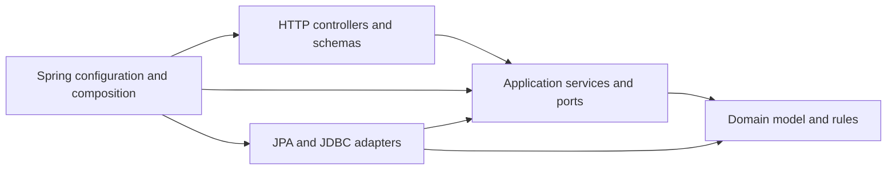

# ADR 0002: Backend application architecture and dependency boundaries

- **Status:** Accepted
- **Date:** 2026-08-09
- **Decision owners:** FBO Manager architecture contributors
- **Tracking issue:** [#31](https://github.com/ecillie/FBO_Manager/issues/31)
- **Related issues:** [#6](https://github.com/ecillie/FBO_Manager/issues/6), [#7](https://github.com/ecillie/FBO_Manager/issues/7), [#8](https://github.com/ecillie/FBO_Manager/issues/8), [#10](https://github.com/ecillie/FBO_Manager/issues/10), [#11](https://github.com/ecillie/FBO_Manager/issues/11), and [#12](https://github.com/ecillie/FBO_Manager/issues/12)

## Context

FBO Manager needs one backend application for the single-airport MVP. The backend must expose the API used by the browser frontend, enforce authorization and business workflows, preserve operational history, and coordinate concurrency-sensitive PostgreSQL writes.

The [MVP architecture](../../architecture.md), [workflow definitions](../mvp-scope-and-workflows.md), [quality attributes](../quality-attributes.md), [database design](../../database-design.md), and [initial schema](../../../db/init/001_schema.sql) already establish the controlling constraints:

- PostgreSQL is the authoritative operational store.
- One deployable backend application and one database are preferred for the MVP.
- Business capabilities must remain understandable without splitting the system into premature microservices.
- Parking assignment, visit transitions, worker and vehicle dispatch, and fuel movements are transactional.
- Competing writes must produce an explicit conflict without partial state.
- Fuel inventory is an append-only ledger, and paired transfers commit both entries or neither.
- Persistence constraints and triggers are defense in depth; they do not replace application workflow rules.
- HTTP clients are untrusted and cannot become the authority for validation, state transitions, transactions, or permissions.
- Normal reads target a 95th-percentile response time below 500 milliseconds and normal writes below one second at 25 concurrent users.

The architecture must define an implementation shape before the Backend MVP issues scaffold code. It must prevent controllers from bypassing application services, keep persistence records from leaking into the API or domain, make transaction ownership visible, and allow module-boundary violations to fail automated checks.

[ADR 0003](0003-api-contracts-and-operational-data-flows.md) defines the exact API contract and operational flows. Issues #12 and #24 implement and publish that contract. ADRs [0004](0004-delegated-identity-and-capability-authorization.md), [0005](0005-portable-single-region-container-deployment.md), [0006](0006-managed-telemetry-and-tested-backup-recovery.md), and [0007](0007-layered-verification-and-immutable-promotion.md) now define the identity, deployment, operations, and testing/release constraints that fit around these backend boundaries.

## Decision

### Architecture style

The MVP backend will be a synchronous, servlet-based Spring Boot modular monolith. It is one executable application and one transaction boundary, internally divided into business-capability modules.

Spring Modulith defines and verifies the logical modules. Each module exposes a deliberately small Java API and keeps its controllers, application services, domain implementation, and persistence adapters internal. Critical cross-capability workflows remain synchronous and may share one local PostgreSQL transaction. A message broker, distributed transaction, and asynchronous event choreography are not required for the MVP.

Domain events may be introduced for non-critical post-commit reactions when a concrete workflow needs them. They must not replace a direct transactional call when the originating operation and reaction must succeed or fail together.

### Runtime and core technology

| Concern | Selection | Version and policy |
| --- | --- | --- |
| Runtime | Java | Java 25 LTS; compile and run against the 25 release line and apply supported security/patch updates |
| Application framework | Spring Boot | 4.1.0; use the Spring Boot parent POM and managed dependency set |
| HTTP stack | Spring MVC | Servlet-based request handling with embedded Tomcat; WebFlux is not part of the MVP baseline |
| Module boundaries | Spring Modulith | 2.1.0 with closed modules, named interfaces, explicit allowed dependencies, and structural verification |
| Build and dependency manager | Apache Maven | Maven 3.9.16 through the committed Maven Wrapper; Maven 4 release candidates are not used |
| Request validation | Jakarta Bean Validation | Use the implementation managed by Spring Boot for HTTP request DTO validation |
| Transactional persistence | Spring Data JPA and Hibernate ORM | Versions managed by Spring Boot; used behind repository adapters rather than exposed as the domain model |
| Read-oriented SQL | Spring `JdbcClient` | Used for PostgreSQL views, operational dashboards, and queries for which an explicit projection is clearer than an entity graph |
| PostgreSQL driver | PostgreSQL JDBC driver | Version managed by Spring Boot; PostgreSQL is the only supported application database |
| Connection pool | HikariCP | Spring Boot default; one application-managed pool with limits set by the environment/deployment decision |
| Schema migrations | Flyway | Version managed by Spring Boot; ordered, handwritten SQL migrations are authoritative |
| Configuration | Spring Boot configuration properties | Immutable, validated `@ConfigurationProperties` objects populated from external configuration |
| Health endpoints | Spring Boot Actuator | Separate liveness and database-aware readiness groups |
| Automated tests | Spring Boot Test, JUnit, Testcontainers, and ArchUnit | Versions managed by the Boot and test dependency sets; PostgreSQL integration tests do not substitute H2 |

The project will inherit from `spring-boot-starter-parent` 4.1.0 so compatible Spring and third-party versions come from one tested bill of materials. Individually overriding managed versions requires a recorded compatibility reason. The Spring Modulith 2.1.0 BOM will manage its artifacts.

The Maven Wrapper configuration, `pom.xml`, and Java release setting are committed. CI invokes `./mvnw` and rejects dependency or plugin resolution that bypasses the declared build. Patch updates within an accepted line are routine maintenance; changing the Java LTS line, Spring Boot major/minor line, persistence approach, or module model requires architecture review.

### Synchronous execution model

The backend uses Spring MVC, JDBC, and imperative JPA transactions. This matches the existing blocking PostgreSQL driver and ORM model, keeps transaction and row-lock behavior direct, and is sufficient for the expected 25 concurrent users and 50-user verification load.

Controllers and application services must not return reactive types or mix reactive and blocking persistence. A later move to WebFlux or R2DBC would require evidence that the synchronous model fails a measured quality target and a superseding decision covering transaction, driver, test, and operational changes.

### Source organization

The intended implementation shape is:

```text
backend/
  pom.xml
  .mvn/
  mvnw
  mvnw.cmd
  src/
    main/
      java/com/ecillie/fbomanager/
        FboManagerApplication.java
        administration/
        aircraft/
        parking/
        visits/
        services/
        fleet/
        fuel/
        workforce/
        tasks/
        operations/
        platform/
      resources/
        application.yml
        db/migration/
    test/
      java/com/ecillie/fbomanager/
```

Each business capability is a closed Spring Modulith application module. A representative module is arranged as follows:

```text
visits/
  package-info.java          # @ApplicationModule and allowed dependencies
  api/                       # named interface available to other modules
    VisitManagement.java
    VisitSummary.java
  internal/
    web/                     # controllers and HTTP request/response DTOs
    application/             # commands, results, and transactional services
    domain/                  # entities, value objects, state rules, domain errors
    persistence/             # JPA records, Spring Data repositories, JDBC adapters
```

Modules may collapse small internal packages into fewer files, but they may not collapse the conceptual boundaries. A type made public only for framework proxying remains internal unless its package is a declared Spring Modulith named interface.

`platform` contains application bootstrap and genuinely cross-cutting technical infrastructure such as configuration binding, database configuration, request correlation, time providers, health wiring, and error mapping. It contains no business rules and must not become a miscellaneous shared-services module.

### Business-capability modules

| Module | Owns | Does not own |
| --- | --- | --- |
| Administration | Singleton airport settings and reusable reference catalogs for fuel, aircraft categories and operation types, services, and vehicle types | Feature-specific operational workflows or the identity/session boundary and capability rules selected by [ADR 0004](0004-delegated-identity-and-capability-authorization.md) |
| Aircraft | Customers, manufacturers, models, physical aircraft, ownership/operator references, normalization, and deactivation rules | Active visits, parking occupancy, or service execution |
| Parking | Parking-area hierarchy, spots, category preferences, operational availability, and parking lookup rules | Visit lifecycle or an independently editable occupancy flag |
| Visits | Aircraft visit lifecycle, arrival/departure timestamps, cancellation, and transactional coordination of parking assignment | Parking master data, aircraft master data, or service/task implementation |
| Services | Service-request creation, fuel-specific request validation, lifecycle, and completion state | Task resource claims or fuel-ledger writes |
| Fleet | Service vehicle and fuel-truck master data, compatibility, operational status, and deactivation | Current aircraft location or independent assignment state |
| Fuel | Tanks, holder compatibility, receipts, transfers, dispenses, adjustments, idempotent inventory effects, and append-only ledger history | Service-request definition, worker employment state, or mutable balance fields |
| Workforce | Workers, roles assigned to workers, schedules, shifts, attendance, active-state rules, and workforce eligibility | Authentication-provider implementation or task lifecycle |
| Tasks | Airport and aircraft tasks, worker/vehicle assignment, dispatch eligibility, start/completion transitions, and resource claims | Worker, fleet, visit, or service master data |
| Operations | Read-only ramp board, parking status, work queues, worker/vehicle current status, and fuel summaries composed from authoritative tables and views | New sources of truth or command-side business rules |

The module owning the business outcome owns orchestration. For example, `visits` coordinates arrival and parking through the public parking contract, `tasks` coordinates worker and vehicle claims through workforce and fleet contracts, and `fuel` coordinates a dispense with the relevant service and actor contracts.

The `operations` module is an explicit read-model exception to ordinary aggregate ownership. Its persistence adapter may query across tables and read-only database views to produce bounded operational projections. It must not mutate another module's tables, import another module's JPA records, or expose persistence records. This allows efficient dashboard queries without creating a web of command-module dependencies or N+1 entity traversal.

### Internal boundary responsibilities

| Boundary | Responsibility | Allowed dependencies | Prohibited behavior |
| --- | --- | --- | --- |
| HTTP controller | Bind HTTP input, run request-schema validation, obtain trusted request/actor context, call one application use case, and map its result to an HTTP response DTO | Module application API and web DTOs; platform web conventions | Importing JPA/Spring Data repositories, opening transactions, implementing state transitions, or returning JPA entities |
| HTTP request/response schema | Describe the external contract and Bean Validation constraints | Java/Jakarta validation and API-wide serialization conventions | Acting as a persistence entity or authoritative domain model |
| Application service | Orchestrate a use case, authorize against trusted capability inputs, enforce workflow order, own the transaction, select locks, and return an application result | Module domain, repository ports, and declared APIs of allowed modules | Depending on controllers, HTTP response types, JPA records, or another module's internals |
| Domain model | Express business state, value objects, normalization, valid transitions, and domain errors | Java standard library and narrowly approved pure shared types | Depending on Spring MVC, JPA, Spring Data, configuration, logging, or environment access |
| Repository port | Define the domain-oriented reads, writes, existence checks, and locking primitives required by application services | Domain entities, identifiers, criteria, and read models | Exposing `EntityManager`, JPA entities, Spring Data interfaces, SQL rows, or transaction control |
| Persistence adapter | Implement repository ports, map JPA/JDBC records to domain objects, translate known database failures, and execute bounded queries | Domain/application ports plus JPA, Spring Data, JDBC, and PostgreSQL infrastructure | Committing transactions, returning persistence records upward, or containing HTTP behavior |
| Configuration | Bind and validate environment-supplied values at startup and construct infrastructure beans | Spring Boot configuration APIs | Scattered environment reads, committed secrets, or business decisions hidden in configuration classes |
| Cross-cutting infrastructure | Provide request IDs, safe logs, clock/timezone access, health checks, exception mapping, and later identity adapters | Platform contracts and framework infrastructure | Becoming an alternate service layer or accessing feature repositories from middleware |

### Dependency direction and enforcement

Within a capability, dependencies point inward:



The following rules are mandatory:

1. Controllers call application services; they do not call Spring Data repositories, `EntityManager`, `JdbcClient`, or another module's persistence adapter.
2. Application services depend on repository ports and declared module APIs, not concrete adapters.
3. Domain packages are framework-free and do not read configuration, the clock, or actor identity from global state; those values arrive through parameters or ports.
4. Persistence adapters depend inward and translate between persistence records and domain/application types.
5. JPA records and Spring Data repository interfaces stay under `internal.persistence` and are never module API types.
6. Cross-module calls use named interfaces declared under the target module's `api` package. Direct imports of another module's `internal` packages are forbidden.
7. Each module declares `@ApplicationModule(allowedDependencies = ...)` in `package-info.java`. Undeclared module dependencies and cycles are build failures.
8. Shared code remains small, stable, and business-neutral. A helper used by one module remains in that module.
9. The application root and platform configuration may wire modules but may not implement feature workflows.

Automated architecture tests call `ApplicationModules.of(FboManagerApplication.class).verify()`. This detects module cycles, access to internal packages, and violations of explicit allowed dependencies. ArchUnit rules additionally verify the HTTP/application/domain/persistence direction inside modules, including that controllers do not depend on repository types and domain packages do not depend on Spring or Jakarta Persistence.

### Persistence mapping and query conventions

JPA entities are persistence records, not the domain or API model. Adapters map them to domain entities, value objects, command results, or read projections before returning. This permits the persistence representation to honor composite keys, database enum types, foreign keys, and ORM requirements without pushing those concerns into business or HTTP code.

The persistence rules are:

- Map PostgreSQL `NUMERIC(14,3)` values to `BigDecimal`; do not convert fuel quantities through binary floating-point types.
- Represent authoritative instants as `Instant` in domain and application code. Airport-local interpretation uses the configured `ZoneId` at explicit boundaries.
- Centralize natural-key normalization in domain value objects or factories before repository lookup or persistence.
- Treat natural identifiers as immutable during ordinary updates. Any supported correction is an explicit application command and transaction.
- Prefer unidirectional, bounded JPA mappings. Do not create a fully connected object graph that enables accidental traversal or hidden queries.
- Disable Open EntityManager in View with `spring.jpa.open-in-view=false`. All required data is loaded and mapped inside the application transaction.
- Configure Hibernate schema handling as `validate`; Hibernate must not create, update, or drop shared-environment schemas.
- Use explicit fetch plans, projections, entity graphs, or repository queries where needed to prevent N+1 behavior.
- Use Spring `JdbcClient` for the existing current-state views and cross-table operational projections when explicit SQL is clearer and more efficient than a JPA graph.
- Bound every list query and make filtering and sorting explicit. A repository method may not expose an unbounded `findAll` path for operational tables.
- Translate known named constraints and PostgreSQL SQLSTATE categories into stable application errors at the adapter boundary.

Flyway SQL migrations under `src/main/resources/db/migration` are the schema source executed by the application and CI. Issue #11 will convert the current `db/init/001_schema.sql` into the initial ordered migration without losing PostgreSQL enums, constraints, partial indexes, triggers, functions, or views. Later applied versioned migrations are immutable; corrections use a new forward migration. ORM metadata is checked against migrations but never generates authoritative DDL.

PostgreSQL 18 is pinned consistently across local, CI, and shared environments by [ADR 0005](0005-portable-single-region-container-deployment.md). Integration tests use PostgreSQL 18 through Testcontainers rather than an in-memory substitute, because the MVP relies on PostgreSQL-specific locking, partial indexes, recursive queries, enums, triggers, and views.

### Transaction ownership and unit-of-work behavior

A public application-service method is the unit-of-work boundary for a command. The concrete service method carries `@Transactional`; the controller, repository, and domain do not. Successful return commits once after the complete use case, and any failure rolls back all writes.

The transaction convention is:

1. The controller validates the HTTP request and calls one application use case.
2. Spring opens or joins the transaction at the public service boundary with `PROPAGATION_REQUIRED`.
3. The service loads state, checks trusted authorization inputs and business preconditions, acquires required locks, and invokes one or more repository ports or module APIs.
4. Persistence adapters may flush when a generated identifier or named constraint result is required before the use case can return. They do not commit.
5. The service returns an immutable application result only after all intended database work has succeeded. Spring commits before control returns through the transactional proxy to the controller.
6. A thrown domain, persistence, or infrastructure failure rolls the transaction back and is mapped outside the service boundary.

Transaction management is configured to roll back on all exceptions. Domain and expected application failures are unchecked exceptions regardless, so transaction behavior does not depend on callers remembering a `rollbackFor` declaration.

Read-only query services use `@Transactional(readOnly = true)` when they need a consistent persistence context. A simple `JdbcClient` query may use the same read-only service boundary. No controller holds a transaction while serializing a response.

Nested application calls join the existing transaction. Core workflows do not use `REQUIRES_NEW`, nested transactions, or independent repository transactions. Services must not rely on Spring proxy interception of self-invocation; transactional entry points are public methods called through their injected bean contract. Network calls, long-running work, and user interaction do not occur while a database transaction is open.

Spring's transaction manager is the application unit-of-work implementation. The MVP does not add a second custom unit-of-work abstraction over it. Repository ports remain transaction-aware because their adapters use the transaction-bound `EntityManager` or `DataSource` supplied by Spring.

### Row-locking responsibilities

Database uniqueness and trigger checks remain the last line of defense, but services acquire locks before making decisions that depend on contested state. Application services decide which resources to lock; persistence ports expose purpose-specific `for update` operations; persistence adapters implement them with JPA pessimistic write locks or explicit PostgreSQL `SELECT ... FOR UPDATE` queries.

| Workflow | Transaction and lock owner | Required locking behavior | Database backstop |
| --- | --- | --- | --- |
| Create an active visit | Visits application service | Lock the aircraft row before checking and inserting its active visit | Partial unique index for one active visit per aircraft |
| Arrive, assign, or reassign parking | Visits application service using parking port | Lock target parking spots in stable key order, then affected visits in stable ID order, before checking availability and updating the visit | Spot-status trigger and partial unique index for one `ON_RAMP` visit per spot |
| Mark a spot out of service | Parking application service | Lock the spot, then check current occupancy inside the same transaction | Trigger/constraints reject incompatible visit state |
| Start a worker shift | Workforce application service | Lock the worker and affected shift before checking current attendance | Partial unique index for one in-progress shift per worker |
| Start or reassign a task | Tasks application service using workforce and fleet ports | Lock workers in ID order, vehicles in identifier order, and then affected tasks before checking eligibility and changing state | Partial unique indexes for one in-progress task per worker and vehicle; task validation trigger |
| Fuel receipt, dispense, or adjustment | Fuel application service | Lock the referenced holder row before validating compatibility and inserting the append-only entry | Fuel validation trigger and append-only trigger |
| Tank-to-truck transfer | Fuel application service | Lock both holder rows in a canonical holder-type/key order, then insert both entries with one transfer-group identifier | One transaction plus fuel validation and ledger constraints |
| Controlled natural-key correction | Owning module application service | Lock the parent and affected dependents in documented deterministic order before the cascade | Foreign keys and controlled `ON UPDATE CASCADE` behavior |

Locks for multiple rows of the same kind are always acquired in ascending normalized key order. Cross-kind lock order is defined by the workflow and must be shared by every command that touches the same resources. This reduces deadlock risk; a deadlock, lock timeout, serialization failure, or final uniqueness race still becomes a traceable conflict or retryable service failure rather than an unhandled response.

The services do not reject a valid fuel ledger entry merely because the resulting estimate is negative or exceeds nominal holder capacity. The lock serializes concurrent evidence; it does not turn capacity into a hard balance rule that contradicts the accepted database design.

### Domain errors and result convention

HTTP, application, domain, and persistence errors remain separate concerns.

HTTP request DTOs use Jakarta Bean Validation for structural requirements such as required fields, formats, positive quantities, and bounded pagination. Application services repeat authoritative business and authorization checks using typed command inputs and trusted actor context.

Expected failures use a closed unchecked `DomainException` hierarchy. Each error contains a stable machine code, a safe summary, and optional safe structured details. It never contains raw SQL, credentials, stack traces, or a persistence record.

| Error category | Meaning | Default HTTP outcome owned with issue #12 |
| --- | --- | --- |
| Validation | Well-formed input violates a domain rule or state precondition not represented as a conflict | `422 Unprocessable Content` |
| Not found | The requested domain resource does not exist or is not visible to the caller | `404 Not Found` |
| Conflict | Current authoritative state, a uniqueness rule, an idempotency record, or a concurrency race prevents the command | `409 Conflict` |
| Authentication required | No valid authenticated identity is available | `401 Unauthorized` |
| Forbidden | The authenticated actor lacks the required capability or override authority | `403 Forbidden` |
| Dependency unavailable | PostgreSQL or another required approved dependency is unavailable | `503 Service Unavailable` when safe to expose as availability |
| Unexpected | An unclassified defect or infrastructure failure occurred | `500 Internal Server Error` with a generic message and request ID |

A global `@RestControllerAdvice` maps request-validation failures, domain errors, translated persistence errors, and unexpected failures into the stable error envelope defined by issue #12. Controllers do not catch and reinterpret errors independently. Known PostgreSQL uniqueness, foreign-key, check, deadlock, serialization, and lock-timeout failures are classified using SQLSTATE and named constraints; driver messages are handled only through the redaction policy in [ADR 0006](0006-managed-telemetry-and-tested-backup-recovery.md) and are never returned to a client.

Successful application services return immutable Java records or domain-safe value objects describing the authoritative outcome. Controllers map those results to response DTOs. Services do not return `ResponseEntity`, JPA entities, Spring Data `Page` objects across module APIs, or transport-specific error wrappers.

Absence is represented by `Optional` only inside a repository or query contract where absence is a normal lookup result. A required missing resource becomes a typed not-found error in the application layer. Empty searches return empty bounded collections. `null`, boolean flags, magic strings, and partially populated results are not failure conventions.

### Configuration and cross-cutting infrastructure

Configuration is loaded through immutable `@ConfigurationProperties` types and validated during startup. Required database URL/credentials, airport timezone, server binding, allowed origins, log level, and later identity settings come from external configuration or secret injection. Feature code receives typed configuration or narrow ports; it does not call `System.getenv`, scatter `@Value` fields, or read profile-specific files directly.

The application uses:

- one configured `Clock` and airport `ZoneId` boundary so time behavior can be tested;
- a request/correlation ID filter and logging context shared by controllers and error mapping;
- Spring Boot Actuator liveness that reports process health without requiring PostgreSQL;
- Actuator readiness that includes database connectivity and the application's ability to serve database-backed requests;
- structured, redacted logging and metric hooks whose fields and transport follow [ADR 0006](0006-managed-telemetry-and-tested-backup-recovery.md);
- an OIDC/login, opaque-session, and trusted actor-context adapter that follows [ADR 0004](0004-delegated-identity-and-capability-authorization.md); and
- graceful Spring lifecycle shutdown so the HTTP server stops accepting work and the Hikari pool closes cleanly.

Cross-cutting middleware may establish context and enforce global transport controls, but it does not query feature repositories or implement business authorization decisions. Capability checks that determine whether a command is allowed occur in application services using trusted actor context.

### Mapping to Backend MVP issues

| Issue | Implementation requirements established by this decision |
| --- | --- |
| [#6: Backend MVP epic](https://github.com/ecillie/FBO_Manager/issues/6) | Deliver one Spring Boot modular monolith whose authenticated APIs, PostgreSQL transactions, migrations, tests, and documentation follow these boundaries. |
| [#10: Bootstrap the backend](https://github.com/ecillie/FBO_Manager/issues/10) | Create the Java 25/Spring Boot 4.1 project, Maven Wrapper, capability packages, Spring Modulith verification, external configuration, Actuator health groups, structured logging baseline, and graceful lifecycle. |
| [#11: Migrations and data access](https://github.com/ecillie/FBO_Manager/issues/11) | Convert the schema to ordered Flyway SQL migrations, configure PostgreSQL JDBC and HikariCP, disable schema generation, validate mappings, separate migration/application permissions or document the compromise, and establish PostgreSQL Testcontainers. |
| [#8: Model and repository layer](https://github.com/ecillie/FBO_Manager/issues/8) | Implement framework-free domain types, internal JPA records, repository ports/adapters, `JdbcClient` read projections, exact decimal/time/enum/composite-key mapping, bounded queries, lock primitives, constraint translation, and N+1-safe loading. |
| [#7: Service and workflow layer](https://github.com/ecillie/FBO_Manager/issues/7) | Implement transactional application services, state machines, capability inputs, cross-module orchestration through named APIs, deterministic locking, idempotent sensitive commands, timezone interpretation, and typed domain errors/results. |
| [#12: API conventions and errors](https://github.com/ecillie/FBO_Manager/issues/12) | Implement the `/api/v1` JSON, envelope, validation, pagination, request-ID, idempotency-header, CORS/body-limit, and centralized error requirements defined by [ADR 0003](0003-api-contracts-and-operational-data-flows.md). |

Issues #24, #25, #26, and #27 build on the same choices for OpenAPI generation, automated tests, CI, and operating documentation. ADRs 0003 through 0007 add API/flow, security, deployment, observability/recovery, and release constraints. They preserve this ADR's dependency and transaction directions; a conflicting future design must supersede the affected decision explicitly.

## Consequences

### Benefits

- Spring Boot supplies a cohesive, production-oriented runtime, configuration model, dependency set, health system, transaction manager, and PostgreSQL integration.
- Java 25 LTS and the Maven Wrapper provide a reproducible supported toolchain.
- Capability-first packages keep the code aligned with airport operations instead of creating one application-wide controller, service, model, and repository layer.
- Spring Modulith and ArchUnit turn dependency rules into executable checks rather than review-only guidance.
- The single application and database allow critical cross-capability workflows to remain ordinary ACID transactions.
- Separate domain, HTTP, and persistence types prevent accidental SQL/JPA behavior and schema details from becoming API contracts.
- JPA reduces routine transactional mapping work, while `JdbcClient` allows explicit efficient dashboard and PostgreSQL-view queries.
- Flyway preserves the existing PostgreSQL-specific constraints, triggers, partial indexes, functions, and views.
- Disabling Open EntityManager in View makes query ownership and transaction scope visible and testable.

### Costs and risks

- Separating JPA records, domain types, and HTTP DTOs creates mapping code. That duplication is intentional because the three models change for different reasons.
- Spring proxy transaction behavior can be misunderstood. Transactional entry points, self-invocation restrictions, flush timing, and rollback tests must be explicit.
- Mixing JPA command repositories and `JdbcClient` read models requires clear ownership and the same transaction-managed data source.
- Spring Modulith boundaries require careful design of named interfaces; overly broad module APIs would preserve compile-time coupling under a different name.
- Capability modules share one process and database. A defect can affect the complete backend, which is accepted for the MVP's scale and operating simplicity.
- Pessimistic locking may increase latency under contention. Lock ordering, bounded transactions, timeouts, and concurrency tests must verify the quality targets.
- Java 25, Spring Boot 4.1, and Spring Modulith 2.1 are current baselines and require contributors and build images to use the selected toolchain.

## Rejected alternatives

| Alternative | Reason not selected for the MVP |
| --- | --- |
| Python with FastAPI | It could satisfy the workflows, but the selected project direction is a Java/Spring backend, and Spring provides the preferred transaction, configuration, health, dependency-management, and modularity conventions in one ecosystem. |
| Node.js with NestJS | A shared language with the frontend is attractive, but it provides no stronger fit for the PostgreSQL-heavy transactional model than the selected Spring stack and would require a separate persistence/module enforcement decision. |
| Spring WebFlux and R2DBC | The workload is modest and the core dependencies are blocking. Reactive flows add transaction, debugging, testing, and context-propagation complexity without a measured requirement. |
| Microservices by business capability | Distributed transactions, deployment units, network failure modes, contract versioning, and operations would add risk without organizational or scale pressure. |
| One application-wide package per technical layer | Global `controller`, `service`, `model`, and `repository` packages obscure capability ownership and make unrelated features depend on each other's internals. |
| Controllers calling Spring Data repositories | This bypasses workflow orchestration, authorization inputs, transaction ownership, state transitions, and consistent error translation. |
| Spring Data REST generated endpoints | Repository-shaped APIs expose persistence concerns and cannot express the required transactional workflows and stable API conventions safely. |
| JPA entities as domain models and response DTOs | Persistence annotations, lazy relationships, schema shape, and serialization would leak across boundaries and invite writes outside application services. |
| Hibernate-generated schema or `ddl-auto=update` | The database depends on PostgreSQL enums, functions, triggers, views, partial indexes, and named constraints that require reviewed ordered SQL migrations. Runtime schema mutation is not an acceptable deployment control. |
| Spring Data JDBC as the only persistence tool | Its aggregate model is credible, but the existing relational design, composite relationships, and broad repository scope fit JPA plus explicit read SQL more directly for the MVP team. |
| jOOQ for every repository | Its generated SQL model is a strong option, especially for read queries, but it adds schema-code-generation lifecycle and build complexity that is not necessary for routine command repositories. This may be revisited if JPA mapping or query evidence becomes costly. |
| Raw JDBC for every repository | It provides complete SQL control but adds repetitive mapping and change-tracking code across the full entity catalog. `JdbcClient` remains available where explicit SQL has a clear benefit. |
| H2 or another in-memory database for repository tests | It cannot verify the PostgreSQL enums, partial indexes, locks, recursive queries, triggers, functions, views, or SQLSTATE behavior on which correctness depends. |
| Asynchronous events for critical state changes | Parking, dispatch, visit, and paired fuel writes must be atomic. Eventual consistency would create partial states that contradict the accepted workflows. |
| A custom unit-of-work framework over Spring transactions | Spring already binds JPA/JDBC resources and provides the required transaction semantics. A second abstraction would obscure rather than clarify ownership. |

## Compliance and revision

Backend scaffolding and reviews must verify that:

- Java, Spring Boot, Spring Modulith, Maven Wrapper, and managed dependencies follow the accepted version policy;
- `ApplicationModules.verify()` passes and every module declares its allowed dependencies;
- ArchUnit rules prevent controllers from importing repositories and domain code from importing Spring/JPA infrastructure;
- controllers call application services and do not own transactions;
- public application-service command methods own transaction boundaries and rollback behavior is tested;
- repository APIs return domain/application types rather than JPA entities or JDBC records;
- Open EntityManager in View and Hibernate schema mutation are disabled;
- Flyway migrations reproduce the complete PostgreSQL schema from an empty database;
- lock acquisition follows the documented owner and deterministic order;
- concurrency tests prove one winner and one clear loser for parking, task resource claims, shifts, and other unique active-state rules;
- paired fuel transfers and other multi-record workflows roll back completely on failure;
- request validation and domain errors reach one centralized safe API mapper;
- current-state reads are bounded and representative query tests guard against N+1 behavior; and
- tests that exercise persistence and concurrency run against the pinned PostgreSQL major version.

A later decision may revise a technology or boundary when implementation evidence shows that the current choice fails a quality target or creates disproportionate maintenance cost. The superseding ADR must identify migration impact, affected module contracts, transaction and locking changes, deployment consequences, and the Backend MVP issues that must be updated.
