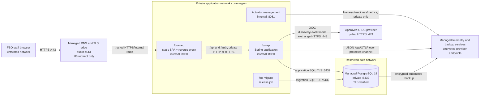

# Environments, Configuration, and Deployment Topology

## 1. Purpose and scope

This document defines how the FBO Manager MVP is built, configured, migrated, and run for GitHub issue [#34](https://github.com/ecillie/FBO_Manager/issues/34). [ADR 0005](decisions/0005-portable-single-region-container-deployment.md) controls the deployment topology and [ADR 0008](decisions/0008-environment-aligned-branch-promotion.md) controls the source-branch/environment promotion path. Backend foundation issue [#10](https://github.com/ecillie/FBO_Manager/issues/10), migration issue [#11](https://github.com/ecillie/FBO_Manager/issues/11), and CI issue [#26](https://github.com/ecillie/FBO_Manager/issues/26) implement these requirements.

The initial shared topology uses a single-region managed container service, a separately managed PostgreSQL database, and platform-managed DNS, TLS, secrets, logs, metrics, and backups. The architecture specifies provider-neutral capabilities rather than coupling the application to one cloud vendor. Local development uses containers; CI uses ephemeral containers and services.

## 2. Environment boundaries

| Environment | Purpose and data | Boundary and access | Lifecycle |
| --- | --- | --- | --- |
| Local | Developer implementation and tests using synthetic data only | Developer workstation; loopback-bound frontend/backend and a containerized PostgreSQL 18 instance. No shared credentials or inbound Internet exposure. | Recreated freely from migrations and deterministic seeds. |
| CI | Pull-request and release verification using generated fixtures only | Ephemeral isolated runner/job network. Unique database per job; no route to Development, NonProd, or production data/secrets. Workflow token has minimum read permissions unless a publish job needs narrowly scoped writes. | Destroyed after the job; test reports and approved artifacts are retained by CI policy. |
| Development (`FBODev`) | Shared integration verification from the protected `FBODev` branch using synthetic data | Non-production platform project/account, private PostgreSQL, development OIDC client/secrets, and no production data or credentials. | Updated after successful integration checks; replaceable from migrations and development artifacts. |
| NonProd (`Release-<version>`) | Stakeholder acceptance, operational rehearsal, migration and restore verification for the frozen release candidate using synthetic or explicitly sanitized data | Dedicated non-production project/account, public HTTPS application endpoint, private database, separate OIDC client and secrets. Named contributors and reviewers only. | Updated only from signed release-candidate artifacts; long-lived environment, replaceable deployment. |
| Production / pilot (`FBOProd`) | Live single-airport operations from a tagged accepted release | Separate project/account, DNS zone/records, OIDC client, database, secret set, telemetry, backup set, and access group. Only approved operators can deploy or access environment controls. | Changes arrive only through exact-digest artifact promotion and the approved release/hotfix workflow. |

Development, NonProd, and production never share a database, database account, OIDC client, signing/hash secret, backup destination, or telemetry access policy. Production data is never copied to local, CI, or Development. A production-derived NonProd dataset requires an approved, logged sanitization process that removes contact, identity, and other sensitive fields.

## 3. Supported runtime baseline

The repository pins exact image digests, Maven/npm dependencies, plugins, and lockfiles during implementation. Architecture pins these compatible major lines:

| Component | Supported line | Policy |
| --- | --- | --- |
| Backend build/runtime | [Java 25 LTS](https://www.oracle.com/java/technologies/java-se-support-roadmap.html) and [Spring Boot 4.1](https://spring.io/projects/spring-boot/) | Build and run on the same Java major. Use a maintained OpenJDK distribution and a minimal non-root runtime image. Patch releases are applied through normal dependency/image maintenance. |
| Frontend build | [Node.js 24 LTS](https://nodejs.org/en/about/previous-releases) | Node is a build/test tool only; it is not required in the production static-web image. The package-manager version is declared by the repository and installs from a frozen lockfile. |
| Database | [PostgreSQL 18](https://www.postgresql.org/support/versioning/) | Local, CI, Development, NonProd, and production use major 18. Run the current supported minor available from the approved distribution/provider. Major upgrades require backup/restore rehearsal, migration/integration tests, and an architecture/release review. |
| Container format | OCI image and immutable digest | Linux `amd64` is the minimum target; add `arm64` only when CI builds and tests a multi-platform image. Do not depend on mutable deployment tags. |

PostgreSQL 18 is selected rather than the PostgreSQL 19 pre-release line. Java 25 and Node 24 are LTS baselines. Runtime and database line changes update the relevant ADRs and compatibility matrix before promotion.

## 4. Deployable units and topology

### 4.1 Units

| Unit | Contents and responsibility | Scale |
| --- | --- | --- |
| `fbo-web` | Immutable hashed SPA assets plus a minimal static server/reverse proxy. Terminates or receives trusted platform TLS, serves the SPA, and proxies `/api`, `/auth`, and permitted health paths to the backend without changing identity headers. | One instance for MVP; stateless and horizontally replaceable. |
| `fbo-api` | Java 25/Spring Boot application image containing API, business modules, health endpoints, and Flyway migration code. Runs as non-root on a read-only filesystem with a writable bounded temporary directory if required. | One instance for MVP. A second instance is allowed only after session/idempotency/concurrency tests verify shared PostgreSQL state. |
| `fbo-migrate` | Short-lived command from the exact `fbo-api` image digest, using the migration database identity. Acquires an advisory lock and applies ordered Flyway migrations before the application is replaced. | Exactly one successful job per environment release. |
| PostgreSQL | Managed PostgreSQL 18 application database; authoritative operational, session, idempotency, and audit state. | One primary for MVP. HA replicas and PITR are Release One work. |

The frontend and backend are separately deployable artifacts but are exposed at one public origin. This keeps the SPA static and cacheable while cookie, CORS, and CSRF behavior remain simple. The migration job is a mode of the backend image, not a separately built artifact.

### 4.2 Network and protocol paths

Only the edge is publicly reachable. Public port 80 redirects to HTTPS without serving application data. Backend application port `8080`, management port `8081`, and PostgreSQL port `5432` are private and allowlisted by workload identity/security group. Management endpoints never traverse the public web proxy except the minimal liveness/readiness paths explicitly selected for external monitoring; details, metrics, environment, loggers, heap, and thread endpoints remain private and authenticated or disabled.

The edge sets and sanitizes forwarding headers. The backend trusts `Forwarded`/`X-Forwarded-*` only from the known proxy network and does not trust client-supplied identity, role, or actor headers. The production hostname is one HTTPS origin, for example `https://fbo.example.com`; environment hostnames and certificates are distinct.

## 5. Configuration and secret injection

Configuration is external to artifacts. The application validates required values before accepting traffic and reports a safe, actionable startup error without echoing secrets.

### 5.1 Configuration classes

| Class | Examples | Injection and change policy |
| --- | --- | --- |
| Build metadata | Git revision, semantic release version, dependency/SBOM identifiers | Embedded by CI and immutable for an artifact digest. |
| Non-secret environment config | environment name, airport timezone expectation, public origin, allowed origins, bind ports, log level, pool sizes, feature rollout state | Environment-scoped deployment configuration under review. Safe values may be environment variables. Every key, type, default, and required status is documented by issue #27. |
| Secrets | database credentials, OIDC client secret/private key, session hash/CSRF keys, telemetry and backup credentials | Platform secret manager to runtime-mounted files/config tree or workload identity. Never frontend variables, repository files, image layers, command arguments, CI logs, or general deployment output. |
| Mutable business configuration | airport settings, roles/capability mappings, reference catalogs | Authorized application workflow and PostgreSQL record, not deployment environment variables. Changes are validated and audited. |

Local development may copy a committed `.env.example` to a gitignored local file containing safe placeholders only. CI creates short-lived credentials for the job. Shared environments resolve secrets at runtime and grant access to the specific workload identity. Secret rotation permits overlapping current/next keys where needed and does not require rebuilding the image.

Required startup validation includes database URL/host, airport timezone consistency, exact public origin and CORS allowlist, OIDC issuer/client/redirect URI, session-key presence and strength, environment name, and production-safe log/header settings. The backend refuses a production profile with HTTP-only cookie settings, wildcard origins, default secrets, automatic schema mutation, or bootstrap enabled after initialization.

## 6. Database identities and connectivity

| Identity | Privileges |
| --- | --- |
| Migration | Owns or can alter the application schema and migration history; used only by `fbo-migrate`, never the running API. |
| Application | Connect/use schema plus least privileges on application tables, sequences, and approved functions/views. It cannot alter schema, migration history, backup settings, or database roles. Audit and fuel history are append-only through approved paths. |
| Backup | Provider-managed or read-only backup capability sufficient for the chosen backup mechanism; cannot serve application traffic. |
| Human break-glass | Time-bound, individually attributed, MFA-controlled operator access for declared incidents/restores. Not used by normal deployment. |

All shared-environment PostgreSQL connections require TLS with hostname and certificate verification. HikariCP starts with a maximum of 10 connections per API instance, a minimum idle count no greater than 2, a 30-second acquisition timeout, and leak detection only in diagnostic environments unless evidence justifies it. Reserve at least 10 database connections for migration, monitoring, backup, and operator recovery; the sum of all application pools must remain below the provider limit. Pool sizing changes follow measured wait time and database capacity, not user count alone.

## 7. Migration and deployment sequence

Flyway owns ordered, immutable production migrations under the backend repository convention selected by issue #11. Repeatable reference-data changes must be idempotent; a changed versioned migration is a CI and startup failure once released.

A NonProd or production deployment follows this order:

1. CI has built, tested, scanned, signed, and published immutable `fbo-web` and `fbo-api` candidate digests plus SBOM/provenance; production promotion requires that NonProd has already run those exact digests.
2. The releaser verifies a recent successful backup and current health, records the release and database version, and pauses if the recovery preconditions fail.
3. Run `fbo-migrate` from the candidate API digest with the migration identity. It acquires a PostgreSQL advisory lock, validates checksums, and applies each pending migration once. No API instance owns migration credentials.
4. If the migration fails, do not replace the application. Capture safe diagnostics, restore only when the documented recovery decision requires it, and otherwise correct with a new forward migration.
5. Replace the API with graceful drain/shutdown, then verify liveness, readiness, schema compatibility, authentication, and a read-only smoke request. Replace the stateless web image and purge only its HTML entry point if necessary; hashed assets remain immutable.
6. Run release smoke checks and monitor errors, latency, pool state, and critical workflows for the documented observation window.

Schema changes follow expand/migrate/contract so the previous and candidate application versions can both operate during replacement. Add nullable structures or dual-compatible reads first, backfill in bounded jobs, switch application behavior, and remove old structures only in a later release. The MVP promises low downtime, not zero downtime: a migration requiring an exclusive rewrite or incompatible change uses an announced maintenance window.

Production migrations have no automatic down scripts. Rolling the application back is allowed only while the applied schema is backward compatible. When data or schema is not safely reversible, the response is a forward fix using a new migration. Restoring a database discards committed changes after the backup and is therefore reserved for corruption/disaster under the recovery runbook, not ordinary release rollback.

## 8. Health, startup, and shutdown

| Probe/control | Behavior |
| --- | --- |
| Liveness | Process/event-loop health only. It does not query PostgreSQL or the identity provider. Failure causes platform restart. |
| Readiness | False until configuration validation completes, the schema is at the supported migration version, required local components start, and a bounded PostgreSQL check succeeds. Provider login availability is monitored separately and does not flap API readiness for existing sessions. |
| Startup | Has a separate allowance of up to 120 seconds; prevents premature liveness restarts while the JVM initializes. Startup never runs schema migrations. |
| Graceful shutdown | Mark unready, stop accepting new requests, allow up to 30 seconds for in-flight requests, then close HTTP resources, schedulers, telemetry flushers, and HikariCP. Platform termination grace is at least 45 seconds. |
| Dependency timeouts | External identity calls use bounded connect/read timeouts and no automatic unsafe retries. SQL lock/statement timeouts classify safe conflicts/dependency failures under the API contract. |

Health responses reveal only status and a request/version identifier appropriate to the audience. They do not reveal config, database coordinates, queries, secrets, worker data, dependency stack traces, or provider tokens.

## 9. Resource limits and operating assumptions

Initial requests/limits are hypotheses validated by representative load tests:

| Unit | Initial request | Initial limit / rule |
| --- | --- | --- |
| `fbo-web` | 0.1 vCPU, 128 MiB | 0.5 vCPU, 256 MiB; static assets only. |
| `fbo-api` | 1 vCPU, 1 GiB | 2 vCPU, 2 GiB; max heap explicitly leaves memory for metaspace, direct buffers, threads, and native libraries. |
| PostgreSQL | 2 vCPU, 4 GiB managed tier | Storage alerts at 70/85%; connection cap accommodates app pool plus reserved operations capacity. Provider class changes use measured evidence. |

Every workload sets CPU/memory limits, a non-root UID, read-only root filesystem, dropped Linux capabilities, bounded temporary storage, and no privileged host mounts. Automatic application restarts are allowed for process failure, but crash loops alert and do not hide an invalid configuration or migration mismatch. Autoscaling is not required for the 25-user MVP; vertical adjustment or a tested second API instance is preferred before introducing orchestration complexity.

## 10. MVP versus Release One

| Concern | MVP / pilot choice | Release One target, not implied by MVP |
| --- | --- | --- |
| Region and application | One region, one web and one API instance; replacement causes brief drain or planned maintenance | Multiple application instances across failure zones, tested load balancing and rolling/blue-green replacement |
| Database | One managed PostgreSQL 18 primary with daily recoverable backups | Multi-zone HA/failover, point-in-time recovery, tested replica/failover behavior |
| Recovery | 24-hour RPO and four-hour RTO; manual restore orchestration | Tighter stakeholder-approved objectives, continuous archive/PITR, automated recovery where justified |
| Delivery | `FBODev` integration deployment, `Release-<version>` exact-digest NonProd acceptance, then manually approved `FBOProd` production release | Progressive/canary delivery and automated rollback only after telemetry and scale justify them |
| Capacity | Fixed resource limits at documented verification headroom | Evidence-based autoscaling and capacity forecasts |

Kubernetes, a service mesh, message broker, distributed cache, multiple regions, and application-managed database replication are not MVP requirements.

## 11. Verification and ownership

Issue #10 provides reproducible local commands, environment validation, probes, structured logging, and graceful shutdown. Issue #11 creates the Flyway baseline, role separation, empty/upgrade migration tests, idempotent reference seeds, and forward-fix policy. Issue #26 builds/scans immutable artifacts, tests PostgreSQL 18 parity, validates pull-request bases, protects credentials/branches, and documents the `FBODev`/`Release-<version>`/`FBOProd` controls.

The application owner owns image contents and startup behavior. The database owner approves migrations and restore decisions. The platform owner owns environment isolation, DNS/TLS, network policy, secrets, resources, and managed services. The release owner follows the promotion sequence. Provider-specific implementation is recorded in the issue #27 operating guide without changing these boundaries.
