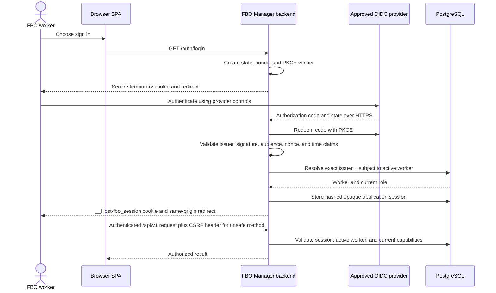

# Security Architecture and Threat Model

## 1. Purpose and scope

This document defines the MVP identity, session, authorization, data-protection, audit, and application-security requirements for GitHub issue [#33](https://github.com/ecillie/FBO_Manager/issues/33). The controlling decision is [ADR 0004](decisions/0004-delegated-identity-and-capability-authorization.md). Implementation belongs to backend security issue [#13](https://github.com/ecillie/FBO_Manager/issues/13), and automated security gates belong to CI issue [#26](https://github.com/ecillie/FBO_Manager/issues/26).

The design assumes one FBO, one public application origin, an OpenID Connect (OIDC) identity provider operated by the FBO or its approved vendor, and staff using modern browsers. FBO Manager remains responsible for linking an authenticated subject to an active `workers` row and for every authorization decision.

## 2. Trust model and identity mapping

The MVP delegates primary authentication to an OIDC provider using Authorization Code flow with PKCE. FBO Manager does not store passwords, password reset answers, recovery codes, or reusable provider credentials for staff. The backend is the OIDC confidential client and owns the application session; the SPA never receives an OIDC access token, ID token, refresh token, or client secret.

An authenticated provider identity has no application authority until an administrator explicitly links it to an active worker. Issue #13 adds a `worker_identities` record with at least:

- the normalized, allowlisted OIDC issuer URI;
- the provider `sub` claim, which is the stable subject identifier;
- the linked `worker_id`;
- creation, update, disable, and last-authenticated timestamps; and
- the acting worker for administrative changes where applicable.

The pair `(issuer, subject)` is unique. Email, display name, and other mutable claims are informational and never lookup keys or authorization inputs. There is no public sign-up and no automatic worker creation. A successful OIDC login is rejected without a linked active worker. Deactivating a worker or identity link revokes all of that worker's application sessions in the same transaction.

## 3. Session and token lifecycle

| Concern | MVP requirement |
| --- | --- |
| OIDC request | Backend generates at least 128 bits of random `state`, `nonce`, and PKCE verifier material. State is single-use and expires after 10 minutes. |
| Provider token validation | Validate the configured issuer, signature against refreshed JWKS, audience/client ID, nonce, issued/expiry times with bounded clock skew, and the authorization-code redirect URI. Algorithms are allowlisted; `none` is forbidden. |
| Provider token storage | Provider tokens exist only in backend memory for validation and identity extraction, then are discarded. `offline_access` is not requested and no OIDC refresh token is retained because the backend calls no downstream provider API. |
| Application session creation | Generate an opaque random value with at least 256 bits of entropy. Persist only a keyed hash plus `worker_id`, creation time, last-use time, absolute expiry, revocation state, and CSRF-secret hash in PostgreSQL. Never log the raw value. |
| Browser storage | Send only `__Host-fbo_session` with `Secure`, `HttpOnly`, `SameSite=Lax`, `Path=/`, and no `Domain`. Do not use `localStorage`, `sessionStorage`, IndexedDB, or readable cookies for authentication material. |
| Expiration | Eight-hour idle timeout and 12-hour absolute lifetime. The session never outlives its absolute expiry. Clock calculations use server UTC. |
| Refresh and rotation | Successful activity may move the idle deadline, but not more often than once every five minutes. Rotate the opaque session identifier after login, privilege-sensitive account changes, and at least every four hours. Rotation invalidates the previous identifier atomically. Reauthentication creates a new session; there is no provider-token refresh. |
| Revocation | Logout, worker/identity deactivation, administrator “revoke sessions,” suspected compromise, or absolute expiry invalidates server state. Revocation takes effect on the next request. Expired/revoked rows are removed by a scheduled retention job after audit evidence is recorded. |
| Logout | `POST /auth/logout` requires CSRF protection, revokes the server session, clears the cookie with identical attributes, and may offer a separate provider logout link. Application logout succeeds even if the provider is unavailable. |
| Concurrent sessions | Permit at most five active sessions per worker. Creating another revokes the oldest and records an audit event. The worker may view and revoke their own sessions. |

Authorization uses the live active-worker and role/capability state on every request, not claims copied into the browser session. A provider outage can block new login but does not make the provider a per-request runtime dependency; an already valid application session continues only until its local expiry or revocation.

## 4. Roles and capabilities

Capabilities are stable uppercase names enforced in application services as well as at HTTP entry points. Roles are configurable bundles persisted through migration-seeded role/capability records. A browser may use server-issued capabilities to hide unavailable actions, but the backend is authoritative. Changes to roles, capability mappings, worker roles, worker active state, or identity links require `ADMINISTER_SECURITY` and an audit reason.

### 4.1 Capability definitions

| Capability | Permitted activity |
| --- | --- |
| `OPERATIONS_READ` | Read authorized airport reference data, visits, services, tasks, workforce availability, non-sensitive inventory balances, and the dashboard. |
| `VISIT_WRITE` | Create and transition aircraft visits and service requests. |
| `PARKING_WRITE` | Assign or change parking within normal preference and availability rules. |
| `TASK_DISPATCH` | Create, assign, reassign, cancel, or schedule operational tasks and resources. |
| `TASK_EXECUTE` | Start and complete an assigned task or service within normal rules. |
| `DISPATCH_OVERRIDE` | Override a documented parking or dispatch preference when an explicit reason is supplied; it never bypasses database safety constraints. |
| `FUEL_MOVE` | Record receipts, paired transfers, and dispenses with the acting worker derived from the session. |
| `FUEL_ADJUST` | Record a compensating inventory adjustment with a required reason; never update or delete ledger history. |
| `WORKFORCE_WRITE` | Manage workers' non-security profile data, schedules, shifts, and attendance. |
| `ADMINISTER_AIRPORT` | Manage airport settings, parking/reference catalogs, vehicles, tanks, and other configuration. |
| `ADMINISTER_SECURITY` | Link identities, assign roles, change capability mappings, activate/deactivate workers, and revoke sessions. |
| `AUDIT_READ` | Search and export audit events through a bounded, access-controlled interface. |

### 4.2 Initial role/capability matrix

`✓` means the migration-seeded role has the capability. Administrators may create narrower site-specific roles, but no client may add capabilities to itself.

| Role | Read | Visit | Parking | Dispatch | Execute | Override | Fuel move | Fuel adjust | Workforce | Airport admin | Security admin | Audit read |
| --- | :---: | :---: | :---: | :---: | :---: | :---: | :---: | :---: | :---: | :---: | :---: | :---: |
| `ADMINISTRATOR` | ✓ | ✓ | ✓ | ✓ | ✓ | ✓ | ✓ | ✓ | ✓ | ✓ | ✓ | ✓ |
| `DISPATCHER` | ✓ | ✓ | ✓ | ✓ | ✓ | ✓ |  |  |  |  |  |  |
| `FUEL_MANAGER` | ✓ |  |  |  | ✓ |  | ✓ | ✓ |  |  |  | ✓ |
| `WORKFORCE_MANAGER` | ✓ |  |  | ✓ | ✓ |  |  |  | ✓ |  |  |  |
| `OPERATOR` | ✓ |  |  |  | ✓ |  | ✓ |  |  |  |  |  |
| `VIEWER` | ✓ |  |  |  |  |  |  |  |  |  |  |  |

`OPERATOR` covers line-service and fueling work for the MVP; a site that must separate fuel duties creates a narrower role before onboarding users. `FUEL_MANAGER` audit access is restricted to inventory-related event categories by the query service even though the capability permits the interface. Only `ADMINISTRATOR` can grant security authority. At least two administrators are recommended after bootstrap so loss of one identity does not prevent recovery.

Sensitive application commands require both the capability and their normal domain preconditions. For example, `TASK_EXECUTE` does not allow a worker to start another worker's assignment unless the endpoint explicitly permits it, and `FUEL_MOVE` cannot forge `recorded_by_worker_id`.

## 5. Request and browser protections

| Control | Requirement |
| --- | --- |
| TLS | Public and service-to-service traffic uses TLS 1.2 or newer, preferring TLS 1.3. HTTP exists only on isolated local development; public port 80 redirects without serving application content. Certificates renew automatically. PostgreSQL connections in shared environments require certificate verification. |
| CORS | The backend allowlists exact configured HTTPS origins. Credentialed requests are permitted only for those origins. Wildcards, reflected origins, and broad subdomain patterns are forbidden. The preferred deployment is same-origin and needs no production CORS allowance. |
| CSRF | Unsafe cookie-authenticated methods require an unguessable CSRF value bound to the server session in a custom header and an allowlisted `Origin`. The bootstrap endpoint may return a readable CSRF value, but it is not authentication material. Safe methods must not mutate state. |
| Input handling | Apply the parsing, body-size, unknown-property, DTO, domain, and persistence validation layers in the [API contract](api-contracts-and-data-flows.md). Use parameterized SQL/ORM bindings. Uploaded files and rich HTML are not MVP inputs. |
| Rate limits | At the public edge and backend, limit login starts/callback failures to 10 per account-and-IP pair per 15 minutes and 60 per IP per 15 minutes. Apply a default authenticated API budget of 300 requests per worker per minute, with stricter endpoint-specific limits for expensive exports. Return `429` and `Retry-After`; never reveal whether an identity is linked. |
| Security headers | Send HSTS after HTTPS is established, `Content-Security-Policy` with `default-src 'self'` and narrow explicit exceptions, `frame-ancestors 'none'`, `object-src 'none'`, `base-uri 'self'`, `form-action 'self'`, `X-Content-Type-Options: nosniff`, `Referrer-Policy: no-referrer`, and a restrictive `Permissions-Policy`. Do not depend on obsolete `X-XSS-Protection`. |
| Caching | Authentication responses and protected representations containing worker, customer, operational, or inventory data use `Cache-Control: no-store`. Static hashed assets may be cached immutably. |
| Error behavior | `401` means missing, invalid, expired, or revoked authentication; `403` means an authenticated worker lacks capability. Responses and logs do not expose provider tokens, session values, raw SQL, stack traces, or whether an unlinked subject exists. |

Rate limits are defense in depth, not authorization. Thresholds are initial values and may be tuned from observed normal traffic without weakening brute-force protection.

## 6. Credentials, secrets, personal data, and logs

- OIDC client credentials or signing keys, database passwords, backup credentials, cookie/hash keys, and telemetry credentials are injected from the environment's secret manager as runtime-mounted files or equivalent protected references. They are never committed, included in images, placed in frontend build variables, or printed.
- Secret access is limited to the workload or named operator that needs it. Rotation supports an overlap of current and next key where the protocol permits. A suspected disclosure triggers immediate rotation, session revocation when relevant, audit review, and incident handling.
- Database accounts are separated into migration, application, backup, and human break-glass responsibilities as described in the [deployment architecture](deployment.md).
- Customer contact data, aircraft ownership/operator relationships, worker contact data, schedules, attendance, and identity links are personal or sensitive operational data. Authorization, bounded exports, TLS, encrypted storage/backups, and environment isolation protect them.
- Diagnostic logs use deny-by-default redaction and field allowlists; operations issue [#35](https://github.com/ecillie/FBO_Manager/issues/35) defines their exact fields, transport, and retention. They never contain raw request/response bodies, authorization/cookie headers, OIDC claims, session IDs, secret values, complete database URLs, or unnecessary contact data.
- Non-production environments use synthetic data. Production data is not copied to local or CI. An approved, audited sanitization process is required before any production-derived troubleshooting dataset is used in staging.

## 7. Security audit events

Audit events are structured application records persisted separately from diagnostic logs. They are append-only to the application account and include a unique event ID, UTC time, category/action, result, request ID, actor worker ID when known, provider issuer/subject hash for authentication events, target type/ID, source network classification, safe changed-field names, required reason, and safe error code. Before/after values are recorded only from an explicit allowlist and never include secrets or contact fields.

Required event families are:

- authentication success/failure, logout, session creation/rotation/revocation, and attempts by inactive or unlinked identities;
- authorization denials for protected actions and all uses of `DISPATCH_OVERRIDE`;
- fuel receipts, paired transfers, dispenses, and especially adjustments, linked to immutable ledger identifiers;
- role/capability changes, identity linking/unlinking, worker activation/deactivation, administrator bootstrap, and session revocation;
- airport/reference configuration changes, backup/restore exercises, migration execution, and break-glass data access; and
- audit searches/exports and changes to log, retention, or security configuration.

Authentication failures without a worker mapping use a keyed one-way subject fingerprint so repeated attempts can be correlated without storing raw claims in ordinary logs. Audit writes participate in the business transaction when they describe a committed application change; a failed authorization attempt is recorded in its own bounded transaction. Failure to persist a required success audit event fails the sensitive command. Audit records are retained online for at least 365 days for the MVP; immutable domain history such as the fuel ledger follows its longer business retention. The eventual regulatory/business retention period is an explicit stakeholder decision before Release One.

## 8. Threat model

| Threat and boundary | Example | Required mitigations | Residual risk / response |
| --- | --- | --- | --- |
| Identity spoofing at browser–IdP–backend boundary | Stolen code, forged token, login CSRF, or mutable email used as identity | TLS, code flow with PKCE, state/nonce, exact issuer/audience/signature validation, single-use callback state, stable `sub`, short callback lifetime | Compromised IdP account can authenticate; provider MFA and local session revocation are operational requirements. |
| Session theft or fixation | XSS reads a bearer token or attacker fixes a session ID | Opaque HttpOnly Secure host cookie, no browser token storage, rotation after login/privilege events, CSP, no-store responses, server-side revocation | A compromised device can act until revocation/expiry; user and admin session-revocation controls are required. |
| CSRF and cross-origin abuse | Malicious site submits a fuel adjustment using ambient cookies | SameSite cookie, exact-origin validation, CSRF header bound to session, narrow CORS, unsafe methods only for writes | Browser/provider defects remain; monitoring alerts on unusual denied attempts. |
| Privilege escalation | Client supplies actor ID/role, stale role persists, or an admin grants excessive access | Server-derived actor, live active-worker/capability lookup, capability checks in application services, audited admin changes, least-privilege seed matrix | Legitimate administrator misuse is possible; audit review and two-administrator practice reduce risk. |
| Injection or malformed input | Crafted filters, JSON, identifiers, or text reach SQL/logs | Bounded DTOs, allowlisted sort/filter fields, parameterized access, output encoding, log-safe structured fields, body limits | New parsers/dependencies can introduce flaws; CI scanning and security review apply. |
| Transaction tampering or replay | Replayed dispense, split transfer, conflicting dispatch | Opaque session actor, idempotency contract, atomic transactions, row locks, database constraints, append-only ledger, audit link | Physical fuel movement may precede failed recording; reconcile with a reasoned compensating entry. |
| Information disclosure | Logs, errors, backups, or lower environments expose PII/secrets | Redaction allowlists, generic errors, encrypted transport/storage/backups, secret manager, synthetic lower-environment data, access reviews | Authorized insiders retain necessary access; access and export events are audited. |
| Denial of service | Login flood, unbounded query, slow request exhausts DB pool | Edge/backend limits, bounded pages/exports, timeouts, body limits, small connection pool, health isolation, alerts | One-instance MVP still has a single-application failure domain; Release One adds resilience. |
| Repudiation | User denies an override, role change, or inventory adjustment | Trusted session actor, request IDs, append-only audit event, required reason, ledger linkage, UTC timestamp | Shared provider accounts destroy accountability and are prohibited. |
| Supply-chain or deployment compromise | Malicious dependency/image or leaked CI token | Lockfiles, least-privilege CI, dependency/license/secret/image scanning, signed immutable artifacts, protected environments | Zero-day risk remains; incident response can halt promotion and rotate credentials. |
| Database or backup compromise | Direct modification, exfiltration, or destructive operator error | Private network, TLS verification, least-privilege DB roles, encryption at rest, append restrictions, independent backups, restore tests, audited break-glass access | MVP lacks multi-zone HA/PITR; accepted limits are the documented RPO/RTO. |

## 9. Secure administrator bootstrap

Normal login cannot auto-provision the first administrator. An operator with deployment and identity-provider administration authority performs this one-time sequence:

1. Create a named, MFA-protected individual account in the approved OIDC provider and obtain its exact issuer and `sub` through a provider-admin view or a one-time authenticated bootstrap inspection command. Do not use a shared account.
2. Run the backend's non-HTTP `admin-bootstrap` command inside the protected application environment. Supply issuer, subject, worker name, and contact fields through interactive input or protected runtime files; no credential is committed or passed in a shell history.
3. The command acquires a database advisory lock and succeeds only when no enabled worker identity and no `ADMINISTRATOR` assignment exist. In one transaction it creates the active worker, exact identity link, administrator role assignment, and bootstrap audit event.
4. The operator signs in normally, creates and verifies a second administrator, then the platform owner disables bootstrap execution through environment configuration. Subsequent administration uses audited application workflows.

Re-running bootstrap after an administrator exists fails closed. Recovery from loss of every administrator requires a documented break-glass runbook, two authorized people, a backup, direct environment access, and an audit record; it is not the normal bootstrap path.

## 10. Verification and ownership

Issue #13 must test token validation, state/nonce/PKCE failure, unlinked and inactive workers, session expiry/rotation/revocation, logout, CSRF, `401`/`403` separation, every seeded role boundary, live role changes, rate limits, first-admin exclusivity, and required audit events. Issue #26 must enforce secret, dependency, source, and artifact scanning plus least-privilege workflow permissions.

The security owner approves provider configuration, exact production origins, session/hash key handling, role-matrix changes, bootstrap/recovery, and incident-driven revocation. The application owner implements controls; the platform owner manages TLS, secret injection, network boundaries, backups, and log access. Changes to identity placement, browser token exposure, session storage, bootstrap, or capability semantics require a superseding ADR and threat-model review.
