# Testing, CI/CD, and Release Strategy

## 1. Purpose and scope

This document defines how FBO Manager verifies architecture, business rules, contracts, security, migrations, concurrency, and release safety for GitHub issue [#36](https://github.com/ecillie/FBO_Manager/issues/36). The controlling decision is [ADR 0007](decisions/0007-layered-verification-and-immutable-promotion.md). Backend test issue [#25](https://github.com/ecillie/FBO_Manager/issues/25) and CI issue [#26](https://github.com/ecillie/FBO_Manager/issues/26) implement the backend and pipeline requirements.

Testing follows risk, not a target number of tests. Fast unit and component tests explain most behavior; PostgreSQL 18 integration and concurrency tests prove rules that depend on transactions, locks, indexes, constraints, triggers, and views; a small critical-path end-to-end suite proves that assembled deployable units work together.

## 2. Verification layers

| Layer | Scope and tools | Required coverage / execution |
| --- | --- | --- |
| Backend unit | Pure domain objects, policies, normalization, state machines, application orchestration with ports faked; JUnit 5 and assertion/test-double libraries supplied by Spring Boot | Every PR; no Spring context or database. Branch cases include valid, invalid, boundary, and compensating behavior. |
| Architecture/module | Spring Modulith `ApplicationModules.verify()` plus ArchUnit dependency/layer rules from [ADR 0002](decisions/0002-backend-application-architecture.md) | Every PR; fails cycles, internal-package access, controller-to-repository coupling, domain framework leakage, or forbidden module dependency. |
| PostgreSQL integration | Repository adapters, migrations, constraints, indexes, triggers, views, transactions, query shape; Testcontainers with pinned PostgreSQL 18 | Every backend PR. No H2/SQLite substitute for accepted database behavior. |
| API/security/contract | Full HTTP serialization, envelopes, validation, auth/CSRF/capabilities, idempotency, status/error mapping, OpenAPI conformance; Spring Boot test server and real PostgreSQL | Every API/backend PR; compare implementation and `contracts/openapi/v1.yaml`. |
| Concurrency | Two or more real database connections/HTTP clients synchronized at contested decision points | Every backend PR for core race cases; repeat enough to detect nondeterminism, with deterministic barriers rather than sleeps. |
| Frontend unit/component | Formatting and state helpers; React Testing Library/Vitest for routes, forms, accessibility, capability rendering, loading/error/conflict/unknown-outcome states; MSW generated/validated against OpenAPI examples | Every frontend PR in browser-like DOM; test observable behavior rather than component internals. |
| Browser end-to-end | Built `fbo-web`, built `fbo-api`, PostgreSQL 18, deterministic test OIDC adapter, and Playwright against a real supported browser | Critical smoke paths on every PR after lower layers; complete critical workflow suite on main/release candidate. No provider production credentials. |
| Performance/reliability | Representative PostgreSQL dataset, 50 simulated authenticated users, dependency failure, graceful drain, backup/restore, and query-plan checks | Scheduled and before production release when affected; baseline evidence retained with artifact/environment metadata. |
| Manual exploratory/accessibility/security | Human review of usability, operational recovery, keyboard/screen-reader behavior, and threat-model changes | Staging release candidate; supplements but never replaces automated rules. |

An end-to-end test does not replace a focused unit or PostgreSQL test. A mocked repository cannot prove a partial unique index, transaction rollback, or row lock. A snapshot alone cannot prove accessible names, keyboard behavior, or correct API errors.

## 3. Business-rule and state-machine test map

| Rule/workflow | Unit | PostgreSQL integration / concurrency | API/security | Frontend / E2E |
| --- | :---: | :---: | :---: | :---: |
| Airport singleton, IANA timezone, UTC/local DST boundaries | ✓ | singleton/check/migration and time-boundary queries | validation/error format | scheduling display/input across skipped/repeated local times |
| Parking hierarchy has no cycles; spot/category preferences guide but do not prohibit overrides | policy | recursive trigger/query, cycle rollback | capability + reason for override | hierarchy editor and override warning/reason |
| One active visit per aircraft; visit transitions `EXPECTED → INBOUND → ON_RAMP → DEPARTED`, with valid cancellation | transition policy | partial unique index, transition transaction, competing visits | success, invalid transition, not-found, idempotency | turnaround happy path and conflict refresh |
| One `ON_RAMP` aircraft per spot and arrive/park is atomic | lock/order policy | two-client race has one commit; losing visit/spot unchanged | `409 PARKING_SPOT_OCCUPIED`, replay behavior | two-user conflict recovery in critical E2E |
| Fuel service requires compatible type, positive decimal quantity, and unit | validation/policy | checks/FKs/precision | `400` shape vs `422` compatibility | form validation and server-error focus |
| Service request and pending task are created atomically | orchestration | forced second-write failure leaves neither; idempotent replay creates once | response envelope/error | request creation reflected in dashboard |
| Vehicle type/fuel-truck subtype compatibility; operational state is derived | policy | constraints/views | validation/compatibility response | available-resource choices refresh |
| One in-progress task per worker and vehicle; dispatch/start atomic | transition/eligibility | synchronized worker and vehicle races; no partial assignment | `409` codes, capabilities, idempotency | dispatcher conflict and authoritative refresh |
| One in-progress shift per worker; at-work status derived | transition policy | partial index/view, concurrent start | workforce role boundaries | scheduling/attendance status |
| Fuel transaction references exactly one holder and is append-only | ledger policy | check constraints; update/delete rejection | no update/delete contract | immutable history display |
| Receipt positive, dispense negative/link to request, adjustment nonzero/reasoned | sign/reason policy | constraints/triggers and audit transaction | capability/error/idempotency | entry and reconciliation error states |
| Tank-to-truck transfer creates equal/opposite entries or neither | transfer calculation | forced failure/race proves atomic pair and group; one replay effect | unknown-outcome retry and conflict | transfer completion/history E2E |
| Estimated balances may be outside nominal range and remain visible | display/policy | balance views with negative/over-capacity history | response decimal strings | anomaly presentation without blocking |
| Current worker/vehicle/dashboard state is one bounded snapshot | projection mapping | one snapshot, query-count/N+1, bounds/truncation/indexes | schema/pagination/freshness | visible-page 10-second poll, hidden pause, resume |
| Active linked worker and current capabilities control every protected action | auth policy | session/identity/role transaction | `401`/`403`, expiry/revocation/inactive/live role change/CSRF | sign-in/out, forbidden route/action, session expiry |
| Required audit and idempotency evidence commits with sensitive changes | orchestration | audit failure rolls back change; key/fingerprint races; retention job boundaries | request/replay headers and safe errors | explicit retry after simulated response loss |

All state transitions also test terminal-state immutability, missing timestamps, invalid backward/skipped transitions, current-state conflict, and retained history. Every regression fix begins with a test that fails for the reported behavior at the lowest layer that can prove it.

## 4. Reproducible test data and isolation

- Builders and scenario fixtures use named defaults, explicit controlled overrides, a fixed/injectable `Clock`, deterministic UUID/random seeds, and unique test identifiers. Tests never depend on wall-clock timing, execution order, or another test's IDs.
- Unit/component tests own their state in process. PostgreSQL integration classes use a fresh database/schema or transaction rollback only when rollback cannot mask commit, trigger, connection, or concurrency behavior. Concurrency/API/E2E tests use committed fixture setup and explicit cleanup or a disposable database.
- CI provisions PostgreSQL 18 from a repository-pinned image digest. Tests apply real Flyway migrations from empty state; they do not build schema through ORM auto-DDL or use `db/init/001_schema.sql` as a parallel runtime path after the migration baseline exists.
- Reference seeds are rerun to prove idempotence. Fixture data is separate from reusable application reference seed data.
- Parallel tests use independent databases/schemas and ports allocated by the test framework. Synchronize concurrency contenders with latches/advisory test barriers and bounded timeouts, never arbitrary sleeps.
- Non-production tests use synthetic people, contacts, aircraft, and identity subjects. Production data, tokens, backup contents, and secrets are prohibited in local/CI fixtures and snapshots.
- Test failure output may include synthetic payloads and query fingerprints but follows the same secret/token redaction rule as production logs.

### 4.1 Migration verification

CI performs all of these checks:

1. Migrate an empty PostgreSQL 18 database to head and verify the schema objects, constraints, indexes, triggers, views, privileges, and seed rows expected from the accepted database design.
2. Rerun approved reference-data seed logic and prove no duplicates or destructive resets.
3. For every release candidate, restore or construct the latest supported prior-release schema/data fixture, apply new migrations, and run integrity plus application smoke tests.
4. Verify released migration checksums are unchanged and a second concurrent migration runner is serialized by the advisory lock.
5. Exercise failure of a migration in staging/test and prove the API does not start against a partially unsupported version. Repair with a new migration or recreated ephemeral database, never by editing released history.

Major PostgreSQL upgrades use a separate compatibility plan that tests dump/restore or `pg_upgrade`, extensions, drivers, Flyway, queries, and performance before changing the pinned major.

## 5. Coverage and test-quality gates

Coverage is a backstop, not proof of correctness. CI enforces:

- at least 90% line and 85% branch coverage for backend domain and application packages combined;
- at least 80% line and 75% branch coverage for backend code overall, excluding generated code, records with no behavior, and configuration explicitly reviewed in the build;
- at least 80% line and 75% branch coverage for frontend source containing behavior, excluding generated OpenAPI types and static entry wiring; and
- 100% enumerated tests for accepted state-transition edges, seeded role/capability rows, required audit families, and the explicit concurrency cases in issue #25.

The gate applies to the repository totals after the baseline implementation and may ratchet upward. New/changed critical code is expected to meet the critical threshold even if the initial repository baseline is lower. Exclusions are committed, narrow, and reviewed; no pull request lowers a threshold merely to pass.

Flaky tests are defects. CI retries infrastructure setup only when the test itself did not begin; it does not automatically rerun a failed assertion to turn the check green. A temporarily quarantined test needs an owner, linked issue, expiry no longer than seven days, and equivalent risk control before merge.

## 6. Pull-request and main-branch controls

`main` is protected. Contributors use short-lived branches and pull requests. The selected merge strategy is squash merge so one reviewed change maps to one main-branch commit and release note; direct pushes and force pushes are prohibited.

### 6.1 Required pull-request checks

| Gate | Required behavior |
| --- | --- |
| Source hygiene | Repository formatting, frontend/backend lint, Java compiler warnings/static analysis, TypeScript strict typecheck, generated-file consistency, and documentation/link/Mermaid checks. |
| Reproducible dependencies | Maven Wrapper and pinned plugin/dependency rules; package-manager frozen lockfile. CI fails uncommitted lockfile or generated OpenAPI client drift. |
| Architecture and tests | Backend unit/module/architecture, PostgreSQL integration, API/security/contract, concurrency, frontend unit/component/accessibility, and critical browser smoke suites. |
| Database/API | Empty and prior-version migration checks, seed rerun, OpenAPI lint, implementation conformance, examples, generated-client build, and breaking-change comparison against `main`. |
| Security/supply chain | Secret scan over history/diff, dependency vulnerability review, static security analysis, license allowlist, container/filesystem scan, least-privilege workflow check, and SBOM generation for release artifacts. |
| Build | Production frontend and backend packages/images build once from the reviewed commit. CI does not publish from an untrusted fork context with secrets. |

All required checks must pass on the current head. At least one approval from a contributor other than the author is required, and approval is dismissed on material new commits. Changes to authentication/authorization, cryptography/secrets, audit, fuel ledger, database migrations, CI workflows, production deployment, backup/restore, or architecture decisions require review from the named security/database/platform/architecture owner as applicable. `CODEOWNERS` expresses these paths when issue #26 is implemented.

Conversations must be resolved. Administrators do not bypass required checks for convenience. Emergency bypass requires two named approvers when available, an incident/change record, an immediate post-merge verification, and a follow-up PR restoring the normal path.

## 7. Supply-chain controls

- Dependabot or an equivalent bot proposes Maven, npm, GitHub Action, and container-base updates. Lockfiles/wrappers are committed; floating `latest` dependencies/actions/images are prohibited.
- Pin third-party CI actions to immutable commit SHAs. Workflows default to read-only repository contents and grant job-specific permissions. Fork pull requests receive no environment secrets or publish credentials. Use OIDC workload federation instead of long-lived cloud keys where supported.
- Run a maintained secret scanner, Java/JavaScript dependency vulnerability scanner, static application security analysis, and OCI image/filesystem scanner. A release has no unresolved critical vulnerability and no known exploited/high vulnerability without a time-bound, owner-approved exception and compensating control.
- Generate CycloneDX or SPDX SBOMs for the API and web artifacts. Retain scan results, build provenance, checksums, and signatures with the release.
- License checks allow approved permissive licenses and fail unknown, denied/copyleft obligations pending review. Dependency source/provenance and license are reviewed before adding a package.
- Never print secrets; mask protected output and test log redaction. A detected committed secret is revoked/rotated even if the commit is later removed.

Tool choices may change as long as the control and failure semantics stay equivalent. Issue #26 documents exact workflow names, required status-check identifiers, scanner versions, severity policy, and exception owners.

## 8. Build artifacts and immutable promotion

A successful protected-main build produces once:

- `fbo-api` OCI image with Java runtime/application and the migration command;
- `fbo-web` OCI image with hashed static assets and web/proxy configuration;
- `contracts/openapi/v1.yaml` plus generated frontend client/types;
- checksums, build/test reports, SBOMs, vulnerability/license results, and signed provenance/attestation; and
- a release manifest recording Git commit, semantic application version, image digests, schema target version, compatibility notes, and required configuration keys.

CI signs images/attestations using short-lived workload identity. Staging and production deploy exact digests from the same build; they do not rebuild, re-resolve dependencies, or inject environment values into frontend JavaScript. Environment configuration and secrets arrive at runtime as defined in [deployment architecture](deployment.md).

## 9. Promotion, migration, and release verification

```mermaid
flowchart LR
    pr["Pull request<br/>review + required checks"] --> merge["Squash to protected main"]
    merge --> build["Build once<br/>scan, SBOM, sign, publish digests"]
    build --> staging["Deploy to staging<br/>preflight + migration job"]
    staging --> verify["E2E, security, migration,<br/>performance/restore checks as affected"]
    verify --> approval["Named production approval<br/>change/recovery preflight"]
    approval --> migrate["Production backup check<br/>single migration job"]
    migrate --> deploy["Deploy same API/web digests"]
    deploy --> observe["Smoke + 30-minute observation<br/>errors, latency, workflows"]
```

Staging promotion is automatic from a successful protected-main artifact when the environment is available. Production promotion is manual and requires the release owner plus business/operations approval, a successful staging soak appropriate to risk (at least 30 minutes for an ordinary MVP change), a recent healthy backup, no active incident, complete release notes, and a compatible migration/rollback-or-forward-fix decision.

The migration job runs before API replacement using the exact API digest and separate migration identity. Expand/migrate/contract schema evolution preserves compatibility with the last production version. A failed migration stops deployment. Do not use production down migrations; issue a new forward migration. Roll back the application only when the new schema remains backward compatible. A database restore is a disaster-recovery action, not routine release rollback.

Release verification includes:

1. correct artifact digests, environment, config validation, schema version, and health/readiness;
2. static asset load and API/OpenAPI compatibility;
3. OIDC login and logout using a designated non-production/staging identity, or a production-safe synthetic authentication check that creates no staff access;
4. authorized read of the dashboard plus bounded representative queries;
5. environment-safe critical write smoke checks where designated test records/processes exist; otherwise recent automated E2E evidence and read-only production checks;
6. no unexpected error, latency, pool, audit, or workflow-conflict increase during a 30-minute observation window; and
7. annotation of the release digest/version in telemetry and the deployment audit record.

The release owner declares success or invokes the compatible rollback/forward-fix path. Failed smoke verification keeps or returns the service unready when safety is uncertain and informs the FBO operations manager.

## 10. Architecture and documentation change rules

A code pull request updates architecture documentation in the same change when it alters any of these:

- system/container/component boundary or permitted dependency direction;
- identity provider/session/token/CSRF model, role capability, audit semantics, trust boundary, data classification, or secret path;
- API major conventions, data representation, idempotency, error model, transaction boundary, lock order, or current-state freshness;
- database source-of-truth rule, schema invariant, state machine, authoritative/derived field, migration ownership, or retention;
- deployable unit, public/private network path, runtime/PostgreSQL major, environment boundary, resource/health contract, or availability assumption;
- telemetry/audit separation, SLO/alert, RPO/RTO, backup/restore responsibility, or data-access policy; or
- required test/review/security gate, artifact format, promotion, rollback/forward-fix, or release approval.

Update the relevant detailed guide, ADR status/consequences or create a superseding ADR, main `docs/architecture.md` summary, Mermaid source, ADR index, and implementation traceability as applicable. A patch implementation that stays within an accepted decision needs no new ADR. CI link and Mermaid checks prevent stale references; reviewers verify semantic consistency.

## 11. Intentional MVP compromises

- One web/API instance and one PostgreSQL primary; no canary, blue/green, automatic failover, multi-zone HA, or PITR.
- No ephemeral preview environment for every pull request. CI assembles all units; staging is the shared full environment.
- Critical browser smoke runs on every PR; the broader E2E, performance, fault, and restore suites run on main/schedule/release according to risk because they are slower.
- Production approval and exceptional vulnerability/license decisions are human, recorded steps rather than autonomous deployment decisions.
- Coverage thresholds focus on behavior-bearing code and enumerated critical cases rather than pursuing 100% across generated/configuration code.
- A manually coordinated forward fix may be safer than automatic rollback after an irreversible migration.

These compromises are acceptable only while the MVP scale and quality targets remain valid. Evidence of missed targets triggers a new issue and, when a major choice changes, a superseding ADR.
