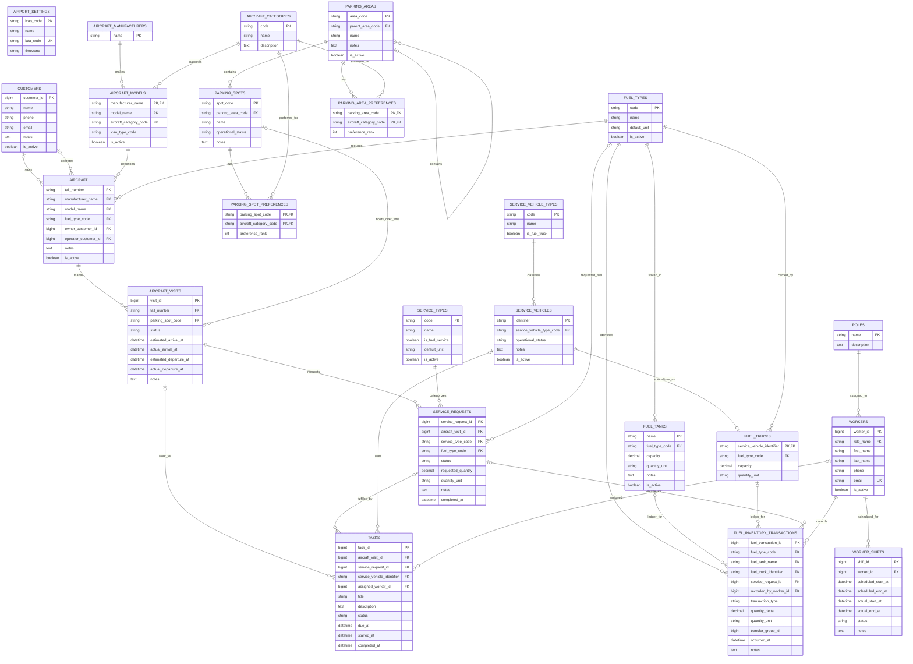

# FBO Manager MVP Entity-Relationship Diagram

This diagram is derived from the [entity-relationship report](database-design.md). It models one FBO at one airport and includes every operational area in the MVP scope. The logical model targets PostgreSQL for both the MVP and Release One; only the database deployment changes between those stages.

## Reading the diagram

- `||` means exactly one.
- `o|` means zero or one.
- `o{` means zero or many.
- `PK`, `FK`, and `UK` identify primary, foreign, and unique keys.
- String primary keys are natural business keys; composite primary keys use more than one marked attribute.
- `bigint` primary keys are database-generated only where the entity has no safe natural key.
- Nullable foreign keys are represented by `o|` at the parent side of a relationship.
- `AIRPORT_SETTINGS` is intentionally standalone because all operational data implicitly belongs to the single configured airport.

The report contains business constraints that cardinality alone cannot show, including one active visit per aircraft, one on-ramp aircraft per parking spot, one active task per worker or vehicle, and exactly one inventory holder per fuel transaction.
