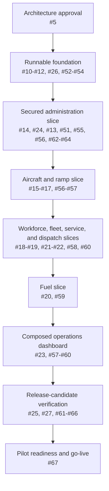

# FBO Manager MVP Delivery Plan

## 1. Purpose and status

This document is the contributor-facing plan for delivering the single-airport FBO Manager MVP. It connects the accepted [architecture](architecture.md), [database design](database-design.md), [API/data-flow contract](architecture/api-contracts-and-data-flows.md), and GitHub [MVP milestone](https://github.com/ecillie/FBO_Manager/milestone/1) to an executable issue order.

GitHub issues are the source of truth for work state and acceptance criteria. This document is the source of truth for dependency order, integration gates, the solo-development execution policy, and release readiness. When they disagree, update both in the same planning change.

The plan assumes one developer and deliberately does not assign fixed sprints. Work is pulled continuously in dependency order with a work-in-progress limit of one implementation slice or pull request. The gates below are checkpoints, not parallel workstreams or calendar commitments.

## 2. MVP outcome and boundary

The MVP is complete when one FBO can configure one airport, authenticate named staff, manage customer/aircraft and operational reference data, execute aircraft turnaround and service workflows, dispatch workers and vehicles, maintain the append-only fuel ledger, monitor current ramp state, and recover the deployed system within the accepted limits.

The controlling quality targets are:

- correct atomic outcomes for parking, visit, task/shift, idempotency, audit, and fuel operations;
- normal read p95 below 500 ms and normal operational write p95 below 1 second at the representative load profile;
- visible dashboard state refreshed within 15 seconds through the accepted polling design;
- 99.5% shared-environment monthly availability excluding planned maintenance;
- daily backups, a 24-hour recovery-point objective, and a four-hour recovery-time objective;
- delegated OIDC identity, active-worker capability authorization, protected backend-owned sessions, and auditable sensitive actions; and
- WCAG 2.2 AA browser-workflow expectations for the supported responsive baseline.

The MVP excludes multi-airport tenancy, native/offline clients, analytics infrastructure, billing, external aviation/business integrations, multi-zone availability, and point-in-time recovery. Those are not hidden backlog items; they require separately approved Release One work.

## 3. Epic map

| Tracking area | Epic | Outcome |
| --- | --- | --- |
| Overall delivery | [#48: FBO Manager MVP delivery](https://github.com/ecillie/FBO_Manager/issues/48) | Coordinates gates and declares the integrated MVP complete. |
| Architecture | [#5: Define the FBO Manager MVP architecture](https://github.com/ecillie/FBO_Manager/issues/5) | Approves and maintains the constraints implemented across the delivery areas. |
| Backend | [#6: Backend MVP](https://github.com/ecillie/FBO_Manager/issues/6) | Delivers PostgreSQL-backed authenticated APIs, contract, tests, telemetry, CI, and operating documentation. |
| Frontend | [#49: Frontend MVP](https://github.com/ecillie/FBO_Manager/issues/49) | Delivers the accessible authenticated browser workflows against generated API types. |
| Platform and release | [#50: MVP platform and pilot release](https://github.com/ecillie/FBO_Manager/issues/50) | Delivers artifacts, environments, OIDC/platform configuration, telemetry, backup/recovery, acceptance, and go-live. |

Architecture issues #28–#37 are complete and epic #5 is closed. Launch-time provider, owner, and approval values remain explicit Gate 5 configuration/acceptance inputs rather than open architecture decisions.

## 4. Delivery model

Work is organized around integration gates rather than layers completed in isolation. Each gate must produce a runnable, testable increment. Only one implementation slice is active at a time; it is tested, documented, reviewed, merged, and verified before the next slice starts. Epics and cross-capability issues may remain open as trackers, but they do not represent simultaneous coding lanes.

Backend issues [#7](https://github.com/ecillie/FBO_Manager/issues/7) and [#8](https://github.com/ecillie/FBO_Manager/issues/8) are cross-capability completion trackers: establish their patterns early, then satisfy their remaining model/repository/service criteria through vertical feature issues #14–#23. They should not become two giant horizontal pull requests. The same incremental rule applies to contract, CI, audit, and test trackers #24–#26, #51, and #61.

The arrows show the default solo execution order. Rows and issue groups below organize acceptance outcomes; they are not assignments to different people.

### Branch and environment flow

| Branch | Purpose | Deployment |
| --- | --- | --- |
| `<issue-number>-<short-description>` | One short-lived implementation slice created from `FBODev`; its pull request explicitly targets `FBODev`. | Pull-request validation only. |
| `FBODev` | Protected integration branch for completed ticket work. It is not the production record. | Development environment after required checks pass. |
| `Release-1.0.0` | Frozen MVP release-candidate branch cut from an approved `FBODev` commit; accepts only approved release fixes. | Non-production acceptance environment. |
| `FBOProd` | Default and production-record branch; accepts release promotion or production hotfix pull requests, not routine features. | Production, from the exact accepted release-candidate artifacts. |

The MVP release is tagged `v1.0.0` on `FBOProd`. Future candidates use `Release-<version>` and matching `v<version>` tags. A release fix is forward-ported to `FBODev`; a production hotfix starts from `FBOProd` and is forward-ported to both `FBODev` and any active release branch. Branch promotion never substitutes for environment approval, migration checks, or exact-digest artifact promotion.

GitHub closing keywords do not close an issue when its pull request merges to non-default `FBODev`. After verifying the merge, manually close the implementation issue with PR/commit evidence and mark its project item Done until #26 supplies equivalent automation. Issue closure still means the Definition of Done is satisfied; it is not delayed until the code eventually promotes to `FBOProd`.

### Gate 0 — Architecture approved

**Issues:** #5 and completed #28–#37.

**Exit:** The consolidated decisions are stakeholder-approved; OIDC/platform provider selection may remain an environment task, but identity, session, network, data, deployment, telemetry, recovery, test, and release boundaries are not open design questions.

### Gate 1 — Runnable foundation

| Outcome area | Issues | Required outcome |
| --- | --- | --- |
| Backend | [#10](https://github.com/ecillie/FBO_Manager/issues/10), [#11](https://github.com/ecillie/FBO_Manager/issues/11), [#12](https://github.com/ecillie/FBO_Manager/issues/12), initial [#7](https://github.com/ecillie/FBO_Manager/issues/7)/[#8](https://github.com/ecillie/FBO_Manager/issues/8) patterns | Spring application starts; PostgreSQL 18 migrates from empty state; shared API/error/idempotency conventions and module boundaries work. |
| Frontend | [#52](https://github.com/ecillie/FBO_Manager/issues/52), [#53](https://github.com/ecillie/FBO_Manager/issues/53), initial [#54](https://github.com/ecillie/FBO_Manager/issues/54) | React application builds; shell, routing, accessibility patterns, and generated-client pipeline exist. |
| Quality/delivery | [#26](https://github.com/ecillie/FBO_Manager/issues/26), initial [#62](https://github.com/ecillie/FBO_Manager/issues/62) | Frozen installs, lint/type/build/test/migration checks run; artifact workflow skeleton exists without production credentials. |

**Exit demonstration:** A contributor can start PostgreSQL, migrate it, run backend and frontend from documented commands, call a versioned health/reference endpoint through the typed client, and reproduce the result in CI.

### Gate 2 — Secured vertical slice

| Outcome area | Issues | Required outcome |
| --- | --- | --- |
| Backend/security | [#13](https://github.com/ecillie/FBO_Manager/issues/13), first slice of [#14](https://github.com/ecillie/FBO_Manager/issues/14), [#24](https://github.com/ecillie/FBO_Manager/issues/24), base [#51](https://github.com/ecillie/FBO_Manager/issues/51) | OIDC subject maps to an active worker; session/capabilities/CSRF work; one administration path is documented in OpenAPI and audited. |
| Frontend | Complete [#54](https://github.com/ecillie/FBO_Manager/issues/54), [#55](https://github.com/ecillie/FBO_Manager/issues/55), first slice of [#56](https://github.com/ecillie/FBO_Manager/issues/56) | Named user signs in, sees capability-aware navigation, reads/updates permitted airport/reference data, and handles expiry/forbidden/logout safely. |
| Platform | [#63](https://github.com/ecillie/FBO_Manager/issues/63), early [#64](https://github.com/ecillie/FBO_Manager/issues/64) | NonProd has private PostgreSQL, exact-origin HTTPS, secret injection, an environment OIDC client, first/second administrators, and basic health/log visibility. |

**Exit demonstration:** A named MFA-protected NonProd user signs in, performs an authorized airport/reference update through the browser, sees the committed result after refresh, and produces correlated request and audit evidence. A viewer receives `403` and cannot expose tokens or grant authority.

### Gate 3 — Operational feature complete

Backend features should be implemented in dependency order. Once a capability contract is stable, its browser workflow should follow before moving deeply into the next operational area. This keeps integration feedback close to the code that caused it without requiring simultaneous backend and frontend work.

| Capability | Backend issues | Frontend issue | Dependencies and notes |
| --- | --- | --- | --- |
| Airport/reference | [#14](https://github.com/ecillie/FBO_Manager/issues/14) | [#56](https://github.com/ecillie/FBO_Manager/issues/56) | Establish controlled catalogs and singleton timezone first. |
| Customer/aircraft | [#15](https://github.com/ecillie/FBO_Manager/issues/15) | [#56](https://github.com/ecillie/FBO_Manager/issues/56) | Depends on reference catalogs; required before visit creation. |
| Parking | [#16](https://github.com/ecillie/FBO_Manager/issues/16) | [#57](https://github.com/ecillie/FBO_Manager/issues/57) | Depends on reference catalogs; defines hierarchy/preferences/availability before arrival. |
| Aircraft visits | [#17](https://github.com/ecillie/FBO_Manager/issues/17) | [#57](https://github.com/ecillie/FBO_Manager/issues/57) | Depends on aircraft and parking; proves the first concurrency-sensitive workflow. |
| Service requests | [#18](https://github.com/ecillie/FBO_Manager/issues/18) | [#58](https://github.com/ecillie/FBO_Manager/issues/58) | Depends on active visits and service/fuel reference data. |
| Fleet/fuel trucks | [#19](https://github.com/ecillie/FBO_Manager/issues/19) | [#59](https://github.com/ecillie/FBO_Manager/issues/59) | Depends on vehicle and fuel references; implement before dispatch and fuel transactions. |
| Workforce/shifts | [#21](https://github.com/ecillie/FBO_Manager/issues/21) | [#60](https://github.com/ecillie/FBO_Manager/issues/60) | Depends on roles/security; implement before dispatch and fuel transactions. |
| Task dispatch | [#22](https://github.com/ecillie/FBO_Manager/issues/22) | [#58](https://github.com/ecillie/FBO_Manager/issues/58) and [#60](https://github.com/ecillie/FBO_Manager/issues/60) | Depends on visits/services, vehicles, and workers/shifts. |
| Fuel inventory | [#20](https://github.com/ecillie/FBO_Manager/issues/20) | [#59](https://github.com/ecillie/FBO_Manager/issues/59) | Depends on fuel references, fuel trucks, workers, and service evidence; preserve atomic paired entries and idempotency. |
| Operations dashboard | [#23](https://github.com/ecillie/FBO_Manager/issues/23) | [#57](https://github.com/ecillie/FBO_Manager/issues/57) plus summaries in #58–#60 | Integrates all operational modules only after their read models are stable. |

[Audit and telemetry #51](https://github.com/ecillie/FBO_Manager/issues/51) evolves with every feature rather than being bolted on after feature completion. Each feature PR supplies its required audit events, workflow metrics, correlation, and redaction tests.

**Exit demonstration:** Administration, aircraft turnaround, service/task dispatch, fuel transfer/dispense/reconciliation, workforce scheduling, and current-state dashboard flows run end to end in NonProd, including conflicts, unknown outcomes, authorization boundaries, and history retention.

### Gate 4 — Release candidate

| Area | Issues | Exit requirement |
| --- | --- | --- |
| Backend completeness | [#24](https://github.com/ecillie/FBO_Manager/issues/24), [#25](https://github.com/ecillie/FBO_Manager/issues/25), [#26](https://github.com/ecillie/FBO_Manager/issues/26), [#27](https://github.com/ecillie/FBO_Manager/issues/27), [#51](https://github.com/ecillie/FBO_Manager/issues/51) | Contract, unit/integration/API/security/concurrency tests, CI gates, audit/telemetry, and operating documentation are complete. |
| Frontend completeness | [#61](https://github.com/ecillie/FBO_Manager/issues/61) and epic [#49](https://github.com/ecillie/FBO_Manager/issues/49) | Component, accessibility, contract-facing, and critical Playwright flows pass against built artifacts. |
| Delivery/operations | [#62](https://github.com/ecillie/FBO_Manager/issues/62), [#63](https://github.com/ecillie/FBO_Manager/issues/63), [#64](https://github.com/ecillie/FBO_Manager/issues/64), [#65](https://github.com/ecillie/FBO_Manager/issues/65) | Signed immutable artifacts promote; Development/NonProd/production boundaries, alerts, access, backups, and isolated restore are verified. |
| Integrated acceptance | [#66](https://github.com/ecillie/FBO_Manager/issues/66) | Full-stack functional, concurrency, performance, security, accessibility, failure, and recovery evidence meets the architecture targets. |

**Exit demonstration:** The exact signed release candidate passes NonProd promotion, migration, all required tests/scans, restored-database smoke verification, and the documented observation window with no unaccepted release blocker.

### Gate 5 — Pilot ready

**Issue:** [#67: Complete MVP pilot readiness and go-live](https://github.com/ecillie/FBO_Manager/issues/67).

**Exit:** Stakeholder UAT, provider/origin/owner/RPO/RTO/retention approvals, first and backup administrators, support contacts, manual continuity, release manifest, production migration/backup preflight, smoke tests, 30-minute observation, and the recorded go/no-go decision are complete. Closing #67 permits closing epics #50, #49, #6, and finally #48 when their checklists agree.

## 5. Critical path and context-switch policy

The most dependency-sensitive path is:

1. backend bootstrap, migrations, API conventions, and initial CI (#10–#12, #26);
2. frontend scaffold, shell, and generated-client foundation (#52–#54), using the first stable OpenAPI operation from #14/#24;
3. backend authentication/audit plus frontend session and administration workflow (#13, #51, #55, #56);
4. deployable artifacts, NonProd identity/network configuration, and baseline operations visibility (#62–#64), followed by the Gate 2 demonstration;
5. customer/aircraft, parking, and visit APIs followed by their administration/ramp UI (#15–#17, #56–#57);
6. fleet, workforce, service, and dispatch prerequisites and browser workflows (#19, #21, #18, #22, #60, #58);
7. fuel transactions and UI (#20, #59), then the composed dashboard (#23 and the affected UI summaries);
8. suite completion, operating docs, backup/restore, and integrated acceptance (#25, #27, #61, #65, #66); and
9. pilot release (#67).

Use the following work-in-progress rules:

- keep one implementation slice and one pull request active at a time;
- deliver tests, audit/telemetry behavior, contract changes, generated types, documentation, and migration handling in the same slice that needs them;
- let epics and cross-capability issues remain open only as checklists; create a child issue before coding when a tracker contains more than one reviewable slice;
- after each ticket merge, synchronize with protected `FBODev`, verify the relevant gate demonstration, update the issue/epic checklists, and then select the next dependency-ready slice;
- if an external dependency blocks progress, record the exact blocker and resume condition, leave the branch at a clean reviewed checkpoint, and switch to one non-overlapping ready slice from the same gate; and
- never carry simultaneous unfinished changes to a migration, generated OpenAPI artifact, global frontend route shell, or shared capability/audit vocabulary.

## 6. Recommended starting queue

The first solo pull queue is:

1. [#10 backend bootstrap](https://github.com/ecillie/FBO_Manager/issues/10);
2. [#11 migrations/data access](https://github.com/ecillie/FBO_Manager/issues/11);
3. [#12 API conventions](https://github.com/ecillie/FBO_Manager/issues/12);
4. the foundation slice of [#26 CI gates](https://github.com/ecillie/FBO_Manager/issues/26);
5. the first read-only airport/reference operation from [#14](https://github.com/ecillie/FBO_Manager/issues/14) and its contract slice in [#24](https://github.com/ecillie/FBO_Manager/issues/24);
6. [#52 frontend scaffold](https://github.com/ecillie/FBO_Manager/issues/52);
7. [#53 frontend shell](https://github.com/ecillie/FBO_Manager/issues/53);
8. [#54 frontend API infrastructure](https://github.com/ecillie/FBO_Manager/issues/54);
9. [#13 backend security](https://github.com/ecillie/FBO_Manager/issues/13) and the base audit/telemetry slice from [#51](https://github.com/ecillie/FBO_Manager/issues/51), as consecutive pull requests;
10. [#55 frontend access](https://github.com/ecillie/FBO_Manager/issues/55) followed by the first administration slice from [#56](https://github.com/ecillie/FBO_Manager/issues/56);
11. the artifact, NonProd, and observability slices from [#62](https://github.com/ecillie/FBO_Manager/issues/62), [#63](https://github.com/ecillie/FBO_Manager/issues/63), and [#64](https://github.com/ecillie/FBO_Manager/issues/64), in that order; then
12. complete the Gate 2 secured administration demonstration before pulling the first Gate 3 slice.

Tracker issues such as #14, #24, #26, #51, and #56 may stay open across multiple slices, but only the current slice is in implementation. This ordering reduces the risk of building UI against unstable contract/security conventions or features against migration and transaction patterns that later change.

## 7. Issue readiness and completion policy

### Definition of ready

An issue is ready to start when:

- its required predecessor behavior is merged or available behind a stable reviewed contract;
- acceptance criteria describe observable outcomes rather than only implementation activity;
- architecture, schema, API, capability, audit, migration, accessibility, telemetry, and deployment impacts are identified where applicable;
- test data and the lowest verification layer capable of proving each critical behavior are understood;
- any product/airport-specific decision is named rather than silently assumed; and
- the issue is small enough for one coherent review. If not, split it by vertical behavior while keeping the parent tracker.

### Definition of done

An implementation issue is done only when:

- code, migrations, generated artifacts, and configuration are reviewed and merged into `FBODev` through the ticket pull request;
- relevant unit, architecture, PostgreSQL, API/contract, authorization, concurrency, component, accessibility, browser, and operational tests pass;
- OpenAPI/types/examples and frontend invalidation/error behavior remain synchronized;
- required capability, actor, audit, idempotency, redaction, metric, and alert behavior is implemented;
- documentation and runbooks are updated with verified commands and safe examples;
- no secret, production data, raw token, or unsafe diagnostic output is introduced;
- the deployed/runtime impact has a compatible migration and rollback/forward-fix decision; and
- the issue checklist and parent epic accurately reflect the merged evidence.

Passing a local happy path is not completion for a concurrency-, security-, inventory-, or recovery-sensitive issue.

## 8. Planning and review cadence

No sprint ceremony is required. Use a lightweight solo cadence:

- after each merge, pull the highest dependency-ready implementation slice from the current gate;
- once per week, review blocked dependencies, issue/PR age, milestone risk, and whether Gate exit evidence is accumulating;
- demonstrate the current vertical slice whenever a workflow becomes end-to-end, not only at phase end;
- keep only one implementation pull request in flight;
- split an issue when review reveals independently releasable behavior, not merely to fit an arbitrary point estimate; and
- update this document and epic checklists when dependency order or MVP scope changes.

If scheduling becomes necessary, estimate only after Gate 1 establishes actual solo cycle time. Calendar estimates made before the repositories and CI are runnable would be speculation.

## 9. Risks and planning responses

| Risk | Planning response |
| --- | --- |
| Backend-first delivery leaves frontend integration late | Gate 2 requires a real browser/security/contract vertical slice before further backend feature depth. |
| Broad layer tickets #7/#8 become giant PRs | Treat them as cross-capability trackers; deliver models, repositories, and services inside vertical feature issues. |
| OpenAPI/client drift blocks frontend | Make #24/#54 early, commit generated types, validate examples, and run breaking-change checks in CI. |
| Security/audit is bolted on after features | Establish #13/#51 in Gate 2; every feature includes capability, actor, audit, redaction, and metric behavior. |
| Fuel/dispatch races appear only near release | Add synchronized PostgreSQL concurrency tests with #17/#20/#21/#22 and track suite completion in #25/#66. |
| Platform work starts after feature completion | Schedule small #62–#65 slices at gate checkpoints and demonstrate every gate in NonProd. |
| Recovery exists only on paper | #65 requires an isolated usable restore and measured RPO/RTO evidence before release-candidate exit. |
| A specific airport decision changes the generic MVP | Keep one-airport architecture stable; put provider, hostname, contact, and local role assignments in environment/business configuration. |
| Stakeholder feedback expands scope during pilot preparation | Evaluate against the documented MVP boundary; defer new integrations, analytics, native/offline, HA, and PITR to Release One unless they block safe pilot use. |

## 10. Plan maintenance

The developer maintains epic [#48](https://github.com/ecillie/FBO_Manager/issues/48), this document, and the backend/frontend/platform tracking epics [#6](https://github.com/ecillie/FBO_Manager/issues/6), [#49](https://github.com/ecillie/FBO_Manager/issues/49), and [#50](https://github.com/ecillie/FBO_Manager/issues/50). A change to scope, a major architecture boundary, or a Gate exit target requires stakeholder review and the relevant ADR/architecture update. Reordering ready slices within a gate is acceptable when it does not change a documented dependency or acceptance target.

Issue closure is evidence-based: child issues close from merged implementation, epics close when their checklists and definition of done are true, and the MVP milestone closes after #67 and epic #48 are complete.
